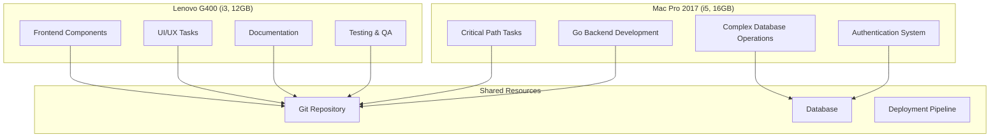
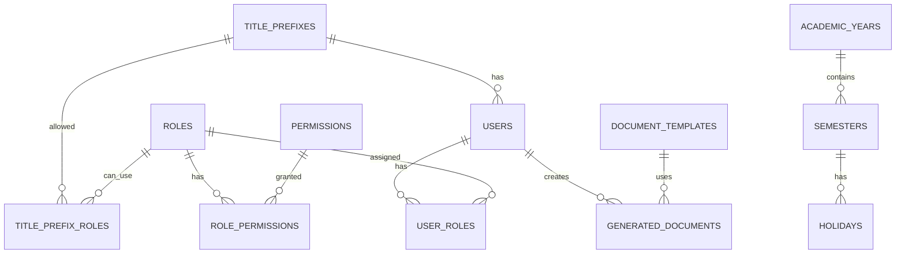

# Design Document - Parallel Development Coordination

## Overview

ระบบการประสานงานการพัฒนาแบบ parallel สำหรับโปรเจคสหกิจศึกษา โดยใช้ monorepo architecture พร้อม Go backend และ Next.js frontend ที่แบ่งงานตามขีดความสามารถของเครื่องและจัดลำดับตาม critical path

## Architecture

### System Architecture



### Monorepo Structure

```
internship-system/
├── apps/
│   ├── backend/              # Legacy AdonisJS (Deprecating)
│   └── frontend/             # Next.js 15.5.3 (Active)
├── backend-go/               # Go Fiber Backend (Primary)
├── packages/
│   ├── shared-types/         # TypeScript interfaces
│   ├── ui-components/        # Reusable UI components
│   ├── database/            # Database schemas & migrations
│   ├── config/              # Shared configurations
│   └── utils/               # Utility functions
└── .kiro/specs/             # Development specifications
    ├── 01-authentication-enhancement/
    ├── 02-user-role-management/
    ├── 03-document-generation/
    ├── 04-super-admin-panel/
    ├── 05-title-prefix-management/
    └── 06-monorepo-integration/
```

## Components and Interfaces

### 1. Authentication System Enhancement

#### Database Schema
```sql
-- Users table with student ID as primary key
CREATE TABLE users (
    student_id VARCHAR(20) PRIMARY KEY,
    email VARCHAR(255) UNIQUE NOT NULL,
    password_hash VARCHAR(255) NOT NULL,
    title_prefix_id INT,
    first_name VARCHAR(100) NOT NULL,
    last_name VARCHAR(100) NOT NULL,
    role_id INT NOT NULL,
    created_at TIMESTAMP DEFAULT CURRENT_TIMESTAMP,
    updated_at TIMESTAMP DEFAULT CURRENT_TIMESTAMP ON UPDATE CURRENT_TIMESTAMP,
    FOREIGN KEY (title_prefix_id) REFERENCES title_prefixes(id),
    FOREIGN KEY (role_id) REFERENCES roles(id)
);

-- Super Admin separate table
CREATE TABLE super_admins (
    id INT AUTO_INCREMENT PRIMARY KEY,
    email VARCHAR(255) UNIQUE NOT NULL,
    password_hash VARCHAR(255) NOT NULL,
    name VARCHAR(200) NOT NULL,
    created_at TIMESTAMP DEFAULT CURRENT_TIMESTAMP
);
```

#### Go Backend API Endpoints
```go
// Authentication routes
POST /api/auth/login              // Student login with student_id
POST /api/auth/register           // Student registration
POST /api/auth/super-admin/login  // Super admin login with email
POST /api/auth/logout             // Logout
GET  /api/auth/me                 // Get current user info
```

### 2. User Role Management System

#### Role Matrix Structure
```go
type Role struct {
    ID          uint   `json:"id" gorm:"primaryKey"`
    Name        string `json:"name" gorm:"unique;not null"`
    DisplayName string `json:"display_name"`
    MaxRoles    int    `json:"max_roles" gorm:"default:1"`
}

type UserRole struct {
    UserID   string `json:"user_id"`
    RoleID   uint   `json:"role_id"`
    IsActive bool   `json:"is_active" gorm:"default:true"`
}

type Permission struct {
    ID     uint   `json:"id" gorm:"primaryKey"`
    Module string `json:"module"`
    Action string `json:"action"`
}

type RolePermission struct {
    RoleID       uint `json:"role_id"`
    PermissionID uint `json:"permission_id"`
}
```

#### Permission Matrix Interface
```typescript
interface PermissionMatrix {
  roles: Role[];
  modules: Module[];
  permissions: {
    [roleId: string]: {
      [moduleId: string]: boolean;
    };
  };
}

interface Module {
  id: string;
  name: string;
  displayName: string;
  category: 'student' | 'faculty' | 'admin' | 'system';
}
```

### 3. Official Document Generation

#### Document Templates
```go
type DocumentTemplate struct {
    ID           uint   `json:"id" gorm:"primaryKey"`
    Name         string `json:"name"`
    Type         string `json:"type"` // "internship" | "coop"
    Language     string `json:"language"` // "th" | "en"
    TemplateHTML string `json:"template_html" gorm:"type:text"`
    NumberFormat string `json:"number_format"` // "thai" | "arabic"
}

type GeneratedDocument struct {
    ID         uint      `json:"id" gorm:"primaryKey"`
    StudentID  string    `json:"student_id"`
    TemplateID uint      `json:"template_id"`
    Data       string    `json:"data" gorm:"type:json"`
    PDFPath    string    `json:"pdf_path"`
    CreatedAt  time.Time `json:"created_at"`
}
```

### 4. Academic Calendar Management

#### Calendar Schema
```go
type AcademicYear struct {
    ID        uint   `json:"id" gorm:"primaryKey"`
    Year      string `json:"year"` // "2567"
    IsActive  bool   `json:"is_active"`
}

type Semester struct {
    ID             uint      `json:"id" gorm:"primaryKey"`
    AcademicYearID uint      `json:"academic_year_id"`
    Name           string    `json:"name"` // "1", "2", "Summer"
    StartDate      time.Time `json:"start_date"`
    EndDate        time.Time `json:"end_date"`
    IsActive       bool      `json:"is_active"`
}

type Holiday struct {
    ID          uint      `json:"id" gorm:"primaryKey"`
    Name        string    `json:"name"`
    Date        time.Time `json:"date"`
    SemesterID  uint      `json:"semester_id"`
    Description string    `json:"description"`
}
```

### 5. Title Prefix Management

#### Title Prefix System
```go
type TitlePrefix struct {
    ID          uint   `json:"id" gorm:"primaryKey"`
    Name        string `json:"name"` // "นาย", "ดร.", "รศ.ดร."
    DisplayName string `json:"display_name"`
    Category    string `json:"category"` // "civilian", "military", "academic"
    IsActive    bool   `json:"is_active" gorm:"default:true"`
}

type TitlePrefixRole struct {
    TitlePrefixID uint `json:"title_prefix_id"`
    RoleID        uint `json:"role_id"`
}
```

## Data Models

### Core Entity Relationships



## Error Handling

### Go Backend Error Handling
```go
type APIError struct {
    Code    int    `json:"code"`
    Message string `json:"message"`
    Details string `json:"details,omitempty"`
}

// Error middleware
func ErrorHandler(c *fiber.Ctx, err error) error {
    code := fiber.StatusInternalServerError
    message := "Internal Server Error"
    
    if e, ok := err.(*fiber.Error); ok {
        code = e.Code
        message = e.Message
    }
    
    return c.Status(code).JSON(APIError{
        Code:    code,
        Message: message,
        Details: err.Error(),
    })
}
```

### Frontend Error Boundaries
```typescript
interface ErrorBoundaryState {
  hasError: boolean;
  error?: Error;
}

class ErrorBoundary extends Component<Props, ErrorBoundaryState> {
  // Error boundary implementation for React components
}
```

## Testing Strategy

### Backend Testing (Go)
```go
// Unit tests for each service
func TestUserService_CreateUser(t *testing.T) {
    // Test user creation logic
}

// Integration tests for API endpoints
func TestAuthAPI_Login(t *testing.T) {
    // Test login endpoint
}

// Database tests
func TestUserRepository_FindByStudentID(t *testing.T) {
    // Test database operations
}
```

### Frontend Testing (Next.js)
```typescript
// Component tests with React Testing Library
describe('LoginForm', () => {
  it('should handle student login', () => {
    // Test login form functionality
  });
});

// E2E tests with Playwright
test('user can complete registration flow', async ({ page }) => {
  // Test complete user journey
});
```

## Machine-Specific Task Allocation

### Mac Pro 2017 (Primary Development)
**Capabilities**: i5 CPU, 16GB RAM
**Assigned Tasks**:
1. **Critical Path Development** (Priority 1-3)
   - Go Backend API development
   - Database schema design & migration
   - Authentication system implementation
   - Complex business logic

2. **Performance-Critical Tasks**
   - PDF generation system
   - Database optimization
   - API performance tuning
   - Integration testing

### Lenovo G400 (Secondary Development)  
**Capabilities**: i3 CPU, 12GB RAM
**Assigned Tasks**:
1. **Frontend Development** (Priority 4-6)
   - React component development
   - UI/UX implementation
   - Form validation
   - Client-side routing

2. **Support Tasks**
   - Documentation writing
   - Unit testing
   - Code review
   - Bug fixes

## Deployment Strategy

### Development Workflow
```bash
# Mac Pro workflow
git checkout feature/auth-system
cd backend-go
go run cmd/main.go  # Development server
go test ./...       # Run tests

# Lenovo workflow  
git checkout feature/frontend-components
cd apps/frontend
npm run dev         # Development server
npm run test        # Run tests
```

### Production Deployment
```yaml
# Docker Compose for production
version: '3.8'
services:
  backend:
    build: ./backend-go
    ports:
      - "8080:8080"
    environment:
      - DB_HOST=mysql
      - DB_PORT=3306
  
  frontend:
    build: ./apps/frontend
    ports:
      - "3000:3000"
    depends_on:
      - backend
  
  mysql:
    image: mysql:8.0
    environment:
      - MYSQL_ROOT_PASSWORD=password
      - MYSQL_DATABASE=internship_db
```

## Performance Considerations

### Database Optimization
- Index on frequently queried fields (student_id, email, role_id)
- Connection pooling for Go backend
- Query optimization for complex joins
- Caching strategy for static data (roles, permissions)

### Frontend Optimization
- Code splitting for large components
- Image optimization with Next.js
- PWA caching strategy
- Lazy loading for non-critical components

### Memory Management
- Go garbage collection tuning
- React component memoization
- Database connection limits
- File upload size restrictions