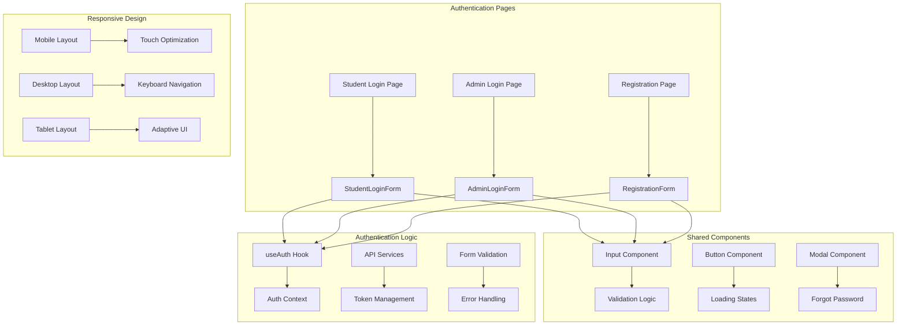
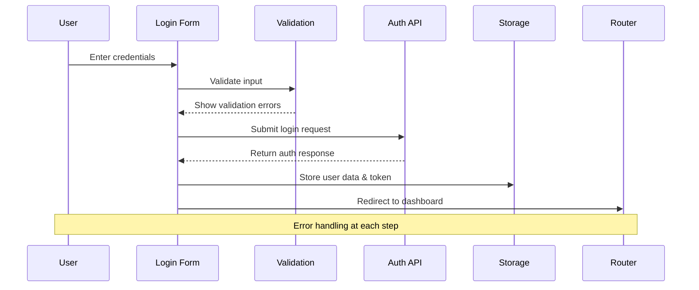

# Authentication User Interface Design

## Overview

การออกแบบ user interface สำหรับระบบ authentication ที่ครอบคลุมทั้ง student login และ admin login โดยมุ่งเน้นการสร้าง UI ที่ user-friendly, responsive, และรองรับการใช้งานบนอุปกรณ์ต่างๆ พร้อมการจัดการ error และ loading states ที่ชัดเจน

## Architecture

### UI Component Architecture



### Authentication Flow Architecture



## Components and Interfaces

### 1. Student Login Form Component

#### Component Interface
```typescript
interface StudentLoginFormProps {
  onSubmit?: (data: StudentLoginDTO) => Promise<void>;
  redirectTo?: string;
  showRegistrationLink?: boolean;
}

interface StudentLoginDTO {
  student_id: string;
  password: string;
}

interface StudentLoginFormState {
  formData: StudentLoginDTO;
  errors: Partial<StudentLoginDTO>;
  isLoading: boolean;
  showForgotPassword: boolean;
}
```

#### Validation Rules
```typescript
interface StudentValidationRules {
  student_id: {
    required: true;
    pattern: /^[0-9]{8,10}$/; // 8-10 digit student ID
    message: "รหัสนักศึกษาต้องเป็นตัวเลข 8-10 หลัก";
  };
  password: {
    required: true;
    minLength: 6;
    message: "รหัสผ่านต้องมีอย่างน้อย 6 ตัวอักษร";
  };
}
```

### 2. Admin Login Form Component

#### Component Interface
```typescript
interface AdminLoginFormProps {
  onSubmit?: (data: AdminLoginDTO) => Promise<void>;
  redirectTo?: string;
}

interface AdminLoginDTO {
  email: string;
  password: string;
}

interface AdminLoginFormState {
  formData: AdminLoginDTO;
  errors: Partial<AdminLoginDTO>;
  isLoading: boolean;
  showForgotPassword: boolean;
}
```

#### Admin-specific Features
```typescript
interface AdminLoginFeatures {
  restrictedAccess: {
    path: '/admin/login';
    validation: 'email-only';
    redirectPath: '/admin/dashboard';
  };
  
  securityFeatures: {
    rateLimiting: boolean;
    sessionTimeout: number;
    auditLogging: boolean;
  };
}
```

### 3. Registration Form Component

#### Component Interface
```typescript
interface RegistrationFormProps {
  onSubmit?: (data: RegistrationDTO) => Promise<void>;
  showLoginLink?: boolean;
}

interface RegistrationDTO {
  student_id: string;
  email: string;
  password: string;
  confirmPassword: string;
  firstName: string;
  lastName: string;
}

interface RegistrationFormState {
  formData: RegistrationDTO;
  errors: Partial<RegistrationDTO>;
  isLoading: boolean;
  step: 'personal' | 'credentials' | 'verification';
}
```

### 4. Shared UI Components

#### Enhanced Input Component
```typescript
interface AuthInputProps extends InputProps {
  realTimeValidation?: boolean;
  validationDelay?: number;
  showValidationIcon?: boolean;
  autoComplete?: string;
  inputMode?: 'text' | 'email' | 'numeric' | 'tel';
}

interface InputValidationState {
  isValid: boolean;
  isValidating: boolean;
  validationMessage?: string;
}
```

#### Enhanced Button Component
```typescript
interface AuthButtonProps extends ButtonProps {
  loadingText?: string;
  successText?: string;
  errorText?: string;
  autoDisableOnSubmit?: boolean;
  submitTimeout?: number;
}
```

### 5. Authentication Hooks

#### Enhanced useAuth Hook
```typescript
interface AuthContextValue {
  user: UserInterface | null;
  isAuthenticated: boolean;
  isLoading: boolean;
  login: (credentials: LoginDTO | StudentLoginDTO) => Promise<void>;
  logout: () => Promise<void>;
  register: (data: RegistrationDTO) => Promise<void>;
  forgotPassword: (email: string) => Promise<void>;
  resetPassword: (token: string, password: string) => Promise<void>;
}

interface AuthState {
  user: UserInterface | null;
  token: string | null;
  refreshToken: string | null;
  isLoading: boolean;
  error: string | null;
}
```

## Data Models

### User Authentication Models
```typescript
interface StudentUser {
  id: number;
  student_id: string;
  email: string;
  firstName: string;
  lastName: string;
  role: 'student';
  permissions: string[];
  profile?: StudentProfile;
  lastLogin?: string;
  isActive: boolean;
}

interface AdminUser {
  id: number;
  email: string;
  firstName: string;
  lastName: string;
  role: 'admin' | 'super_admin';
  permissions: string[];
  department?: string;
  lastLogin?: string;
  isActive: boolean;
}

interface AuthTokens {
  access_token: string;
  refresh_token: string;
  token_type: 'Bearer';
  expires_in: number;
  expires_at: string;
}
```

### Form State Models
```typescript
interface FormFieldState {
  value: string;
  error?: string;
  touched: boolean;
  validating: boolean;
  valid: boolean;
}

interface FormState<T> {
  fields: Record<keyof T, FormFieldState>;
  isSubmitting: boolean;
  submitError?: string;
  submitSuccess: boolean;
}
```

### Responsive Design Models
```typescript
interface ResponsiveBreakpoints {
  mobile: '(max-width: 640px)';
  tablet: '(min-width: 641px) and (max-width: 1024px)';
  desktop: '(min-width: 1025px)';
}

interface TouchOptimization {
  minTouchTarget: '44px';
  touchPadding: '12px';
  swipeGestures: boolean;
  hapticFeedback: boolean;
}
```

## Error Handling

### Form Validation Errors
```typescript
interface ValidationErrorHandling {
  realTimeValidation: {
    debounceDelay: 300;
    showErrorsOnBlur: boolean;
    showSuccessIndicator: boolean;
  };
  
  submitValidation: {
    preventSubmitOnError: boolean;
    highlightErrorFields: boolean;
    scrollToFirstError: boolean;
  };
  
  errorMessages: {
    required: "กรุณากรอกข้อมูลในช่องนี้";
    invalidFormat: "รูปแบบข้อมูลไม่ถูกต้อง";
    minLength: "ข้อมูลสั้นเกินไป";
    maxLength: "ข้อมูลยาวเกินไป";
    passwordMismatch: "รหัสผ่านไม่ตรงกัน";
    emailExists: "อีเมลนี้ถูกใช้งานแล้ว";
    studentIdExists: "รหัสนักศึกษานี้ถูกใช้งานแล้ว";
  };
}
```

### API Error Handling
```typescript
interface APIErrorHandling {
  authenticationErrors: {
    401: "อีเมลหรือรหัสผ่านไม่ถูกต้อง";
    403: "ไม่มีสิทธิ์เข้าถึงระบบ";
    429: "พยายามเข้าสู่ระบบบ่อยเกินไป กรุณารอสักครู่";
    500: "เกิดข้อผิดพลาดของระบบ กรุณาลองใหม่อีกครั้ง";
  };
  
  networkErrors: {
    offline: "ไม่สามารถเชื่อมต่ออินเทอร์เน็ตได้";
    timeout: "การเชื่อมต่อหมดเวลา กรุณาลองใหม่อีกครั้ง";
    serverError: "เซิร์ฟเวอร์ไม่ตอบสนอง กรุณาลองใหม่ภายหลัง";
  };
  
  retryMechanism: {
    maxRetries: 3;
    retryDelay: 1000;
    exponentialBackoff: boolean;
  };
}
```

### Offline Handling
```typescript
interface OfflineHandling {
  detection: {
    useNavigatorOnline: boolean;
    pingEndpoint: '/api/health';
    checkInterval: 30000;
  };
  
  userExperience: {
    showOfflineMessage: boolean;
    disableSubmitButtons: boolean;
    cacheFormData: boolean;
    retryOnReconnect: boolean;
  };
  
  offlineMessage: {
    title: "ไม่มีการเชื่อมต่ออินเทอร์เน็ต";
    message: "กรุณาตรวจสอบการเชื่อมต่อและลองใหม่อีกครั้ง";
    retryButton: "ลองใหม่";
  };
}
```

## Responsive Design Strategy

### Mobile-First Approach
```typescript
interface MobileDesignPrinciples {
  touchTargets: {
    minSize: '44px';
    spacing: '8px';
    feedback: 'visual + haptic';
  };
  
  formLayout: {
    singleColumn: boolean;
    stackedLabels: boolean;
    fullWidthInputs: boolean;
    largerFontSizes: boolean;
  };
  
  navigation: {
    thumbReachable: boolean;
    swipeGestures: boolean;
    backButtonSupport: boolean;
  };
}
```

### Tablet Optimization
```typescript
interface TabletDesignPrinciples {
  layout: {
    twoColumnForms: boolean;
    sidebarNavigation: boolean;
    modalDialogs: boolean;
  };
  
  interaction: {
    hoverStates: boolean;
    keyboardNavigation: boolean;
    touchAndMouse: boolean;
  };
}
```

### Desktop Enhancement
```typescript
interface DesktopDesignPrinciples {
  layout: {
    centeredForms: boolean;
    maxWidth: '400px';
    cardDesign: boolean;
  };
  
  interaction: {
    keyboardShortcuts: boolean;
    tabNavigation: boolean;
    hoverEffects: boolean;
  };
  
  performance: {
    animations: boolean;
    transitions: boolean;
    parallax: boolean;
  };
}
```

## Security Considerations

### Client-Side Security
```typescript
interface ClientSecurityMeasures {
  inputSanitization: {
    xssProtection: boolean;
    sqlInjectionPrevention: boolean;
    htmlEscaping: boolean;
  };
  
  tokenManagement: {
    secureStorage: 'httpOnly cookies' | 'localStorage' | 'sessionStorage';
    tokenExpiration: boolean;
    automaticRefresh: boolean;
  };
  
  formSecurity: {
    csrfProtection: boolean;
    rateLimiting: boolean;
    captchaIntegration?: boolean;
  };
}
```

### Privacy Protection
```typescript
interface PrivacyProtection {
  dataMinimization: {
    collectOnlyNecessary: boolean;
    clearFormOnUnmount: boolean;
    noAutoComplete: string[];
  };
  
  userConsent: {
    cookieConsent: boolean;
    dataProcessingConsent: boolean;
    marketingConsent: boolean;
  };
}
```

## Performance Optimization

### Loading Performance
```typescript
interface LoadingOptimization {
  codesplitting: {
    lazyLoadForms: boolean;
    dynamicImports: boolean;
    routeBasedSplitting: boolean;
  };
  
  assetOptimization: {
    imageOptimization: boolean;
    fontPreloading: boolean;
    criticalCSS: boolean;
  };
  
  caching: {
    staticAssets: boolean;
    apiResponses: boolean;
    formValidation: boolean;
  };
}
```

### Runtime Performance
```typescript
interface RuntimeOptimization {
  formPerformance: {
    debouncedValidation: boolean;
    memoizedComponents: boolean;
    virtualizedLists: boolean;
  };
  
  stateManagement: {
    optimisticUpdates: boolean;
    batchedUpdates: boolean;
    stateNormalization: boolean;
  };
}
```

## Accessibility (a11y) Features

### WCAG Compliance
```typescript
interface AccessibilityFeatures {
  keyboardNavigation: {
    tabOrder: boolean;
    focusManagement: boolean;
    skipLinks: boolean;
    keyboardShortcuts: boolean;
  };
  
  screenReaderSupport: {
    ariaLabels: boolean;
    ariaDescriptions: boolean;
    liveRegions: boolean;
    roleAttributes: boolean;
  };
  
  visualAccessibility: {
    highContrast: boolean;
    focusIndicators: boolean;
    colorBlindnessSupport: boolean;
    textScaling: boolean;
  };
  
  errorAccessibility: {
    ariaInvalid: boolean;
    errorAnnouncement: boolean;
    errorSummary: boolean;
    fieldAssociation: boolean;
  };
}
```

## Implementation Approach

### Phase 1: Core Authentication Forms
1. Enhance existing LoginForm to support student_id field
2. Create separate AdminLoginForm with email-only authentication
3. Implement real-time validation with proper error handling
4. Add responsive design improvements for mobile devices

### Phase 2: Registration System
1. Create multi-step RegistrationForm component
2. Implement student ID validation and uniqueness checking
3. Add email verification workflow
4. Create password strength validation

### Phase 3: Enhanced User Experience
1. Implement forgot password functionality
2. Add loading states and progress indicators
3. Create offline detection and handling
4. Add form data persistence for better UX

### Phase 4: Advanced Features
1. Implement biometric authentication support
2. Add social login options if required
3. Create admin-specific security features
4. Add comprehensive accessibility features

### Phase 5: Performance & Security
1. Implement advanced security measures
2. Add performance monitoring and optimization
3. Create comprehensive error tracking
4. Add automated testing for all authentication flows

## Testing Strategy

### Unit Testing
- Component rendering and prop handling
- Form validation logic
- Error handling scenarios
- Responsive behavior

### Integration Testing
- Authentication flow end-to-end
- API integration testing
- Form submission and error handling
- Navigation and routing

### Accessibility Testing
- Keyboard navigation testing
- Screen reader compatibility
- Color contrast validation
- Focus management testing

### Performance Testing
- Form rendering performance
- Validation response times
- Network error handling
- Mobile device performance