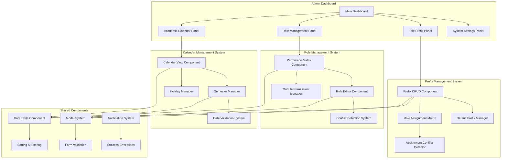
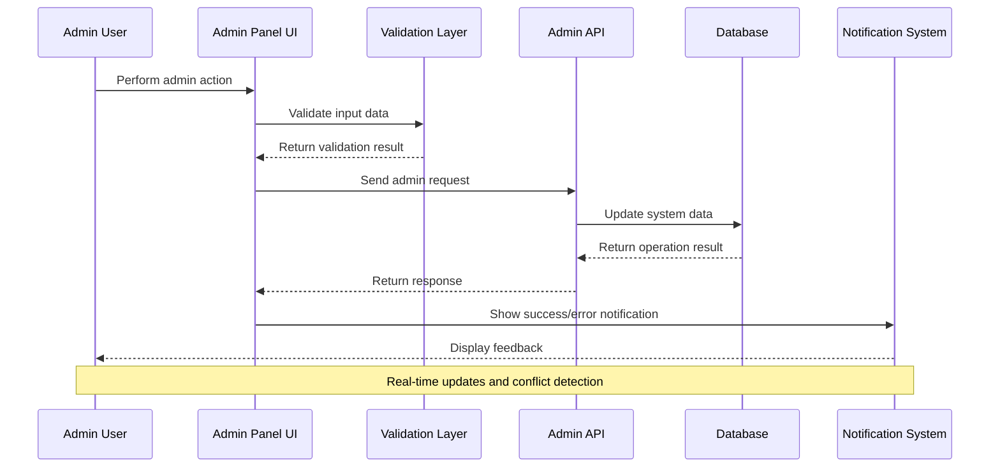

# Super Admin Configuration Panels Design

## Overview

การออกแบบ comprehensive admin interface สำหรับ Super Admin ในการจัดการระบบทั้งหมด ประกอบด้วย Role Management Matrix, Academic Calendar Interface, และ Title Prefix Management UI โดยมุ่งเน้นการสร้าง UI ที่ใช้งานง่าย มีประสิทธิภาพ และรองรับการจัดการข้อมูลที่ซับซ้อน

## Architecture

### Admin Panel Architecture



### Data Flow Architecture



## Components and Interfaces

### 1. Role Management Matrix Component

#### Component Interface
```typescript
interface RoleManagementMatrixProps {
  roles: Role[];
  modules: SystemModule[];
  permissions: Permission[];
  onPermissionChange: (roleId: number, moduleId: number, permission: string, enabled: boolean) => Promise<void>;
  onSaveChanges: () => Promise<void>;
  autoSave?: boolean;
}

interface Role {
  id: number;
  name: string;
  displayName: string;
  description: string;
  isSystem: boolean;
  permissions: RolePermission[];
  createdAt: string;
  updatedAt: string;
}

interface SystemModule {
  id: number;
  name: string;
  displayName: string;
  description: string;
  category: 'core' | 'academic' | 'administrative' | 'reporting';
  availablePermissions: string[];
  dependencies: number[];
}

interface RolePermission {
  roleId: number;
  moduleId: number;
  permission: string;
  granted: boolean;
  inheritedFrom?: number;
  conflicts?: PermissionConflict[];
}
```

#### Matrix State Management
```typescript
interface MatrixState {
  permissions: Map<string, boolean>; // key: `${roleId}-${moduleId}-${permission}`
  conflicts: PermissionConflict[];
  pendingChanges: PendingChange[];
  isLoading: boolean;
  isSaving: boolean;
  lastSaved: Date | null;
}

interface PermissionConflict {
  type: 'dependency' | 'exclusion' | 'hierarchy';
  roleId: number;
  moduleId: number;
  permission: string;
  conflictsWith: {
    roleId: number;
    moduleId: number;
    permission: string;
  };
  severity: 'warning' | 'error';
  message: string;
}
```

### 2. Academic Calendar Interface Component

#### Component Interface
```typescript
interface AcademicCalendarProps {
  academicYear: string;
  semesters: Semester[];
  holidays: Holiday[];
  onSemesterCreate: (semester: CreateSemesterDTO) => Promise<void>;
  onSemesterUpdate: (id: number, semester: UpdateSemesterDTO) => Promise<void>;
  onSemesterDelete: (id: number) => Promise<void>;
  onHolidayCreate: (holiday: CreateHolidayDTO) => Promise<void>;
  onHolidayUpdate: (id: number, holiday: UpdateHolidayDTO) => Promise<void>;
  onHolidayDelete: (id: number) => Promise<void>;
}

interface Semester {
  id: number;
  name: string;
  academicYear: string;
  startDate: string;
  endDate: string;
  registrationStartDate: string;
  registrationEndDate: string;
  examStartDate: string;
  examEndDate: string;
  isActive: boolean;
  holidays: Holiday[];
}

interface Holiday {
  id: number;
  name: string;
  startDate: string;
  endDate: string;
  type: 'national' | 'university' | 'semester_break';
  description?: string;
  isRecurring: boolean;
  semesterId?: number;
}
```

#### Calendar Validation System
```typescript
interface CalendarValidation {
  dateConflicts: DateConflict[];
  semesterOverlaps: SemesterOverlap[];
  holidayConflicts: HolidayConflict[];
  registrationPeriodIssues: RegistrationIssue[];
}

interface DateConflict {
  type: 'overlap' | 'gap' | 'invalid_sequence';
  entity1: CalendarEntity;
  entity2: CalendarEntity;
  conflictDates: DateRange;
  severity: 'error' | 'warning';
  message: string;
}
```

### 3. Title Prefix Management Component

#### Component Interface
```typescript
interface TitlePrefixManagementProps {
  prefixes: TitlePrefix[];
  roles: Role[];
  assignments: PrefixRoleAssignment[];
  onPrefixCreate: (prefix: CreatePrefixDTO) => Promise<void>;
  onPrefixUpdate: (id: number, prefix: UpdatePrefixDTO) => Promise<void>;
  onPrefixDelete: (id: number) => Promise<void>;
  onAssignmentChange: (prefixId: number, roleId: number, assigned: boolean) => Promise<void>;
  onLoadDefaults: () => Promise<void>;
}

interface TitlePrefix {
  id: number;
  thai: string;
  english: string;
  abbreviation: string;
  category: 'academic' | 'professional' | 'honorary' | 'religious';
  gender: 'male' | 'female' | 'neutral';
  isDefault: boolean;
  sortOrder: number;
  isActive: boolean;
}

interface PrefixRoleAssignment {
  prefixId: number;
  roleId: number;
  isDefault: boolean;
  canModify: boolean;
  assignedBy: number;
  assignedAt: string;
}
```

#### Assignment Conflict Detection
```typescript
interface AssignmentConflictDetection {
  genderConflicts: GenderConflict[];
  categoryConflicts: CategoryConflict[];
  duplicateAssignments: DuplicateAssignment[];
  missingDefaults: MissingDefault[];
}

interface GenderConflict {
  prefixId: number;
  roleId: number;
  conflictType: 'gender_mismatch' | 'gender_ambiguity';
  message: string;
  suggestions: string[];
}
```

### 4. Shared Admin Components

#### Enhanced Data Table Component
```typescript
interface AdminDataTableProps<T> {
  data: T[];
  columns: TableColumn<T>[];
  loading?: boolean;
  pagination?: PaginationConfig;
  sorting?: SortingConfig;
  filtering?: FilteringConfig;
  selection?: SelectionConfig;
  actions?: TableAction<T>[];
  onRowClick?: (row: T) => void;
  onSelectionChange?: (selectedRows: T[]) => void;
  customRowRenderer?: (row: T, index: number) => React.ReactNode;
}

interface TableColumn<T> {
  key: keyof T;
  title: string;
  width?: string;
  sortable?: boolean;
  filterable?: boolean;
  render?: (value: any, row: T) => React.ReactNode;
  headerRender?: () => React.ReactNode;
}
```

#### Admin Modal System
```typescript
interface AdminModalProps {
  isOpen: boolean;
  onClose: () => void;
  title: string;
  size: 'sm' | 'md' | 'lg' | 'xl' | 'full';
  type: 'form' | 'confirmation' | 'info' | 'warning' | 'error';
  showCloseButton?: boolean;
  closeOnOverlayClick?: boolean;
  closeOnEscape?: boolean;
  children: React.ReactNode;
  footer?: React.ReactNode;
}

interface AdminFormModalProps extends AdminModalProps {
  onSubmit: (data: any) => Promise<void>;
  onCancel: () => void;
  submitText?: string;
  cancelText?: string;
  isSubmitting?: boolean;
  validationErrors?: Record<string, string>;
}
```

## Data Models

### Admin System Models
```typescript
interface AdminSystemConfig {
  roles: Role[];
  modules: SystemModule[];
  permissions: Permission[];
  academicCalendar: AcademicCalendar;
  titlePrefixes: TitlePrefix[];
  systemSettings: SystemSettings;
}

interface Permission {
  id: string;
  name: string;
  displayName: string;
  description: string;
  category: string;
  dependencies: string[];
  exclusions: string[];
  level: 'read' | 'write' | 'delete' | 'admin';
}

interface AcademicCalendar {
  id: number;
  academicYear: string;
  startDate: string;
  endDate: string;
  semesters: Semester[];
  holidays: Holiday[];
  importantDates: ImportantDate[];
}
```

### Form State Models
```typescript
interface AdminFormState<T> {
  data: T;
  originalData: T;
  errors: Record<keyof T, string>;
  touched: Record<keyof T, boolean>;
  isSubmitting: boolean;
  isDirty: boolean;
  isValid: boolean;
  submitAttempted: boolean;
}

interface BulkOperationState<T> {
  selectedItems: T[];
  operation: 'update' | 'delete' | 'export' | 'assign';
  isProcessing: boolean;
  progress: number;
  errors: BulkOperationError[];
  completed: number;
  total: number;
}
```

## Error Handling

### Admin Operation Error Handling
```typescript
interface AdminErrorHandling {
  permissionErrors: {
    insufficientPermissions: "คุณไม่มีสิทธิ์ในการดำเนินการนี้";
    roleConflict: "การกำหนดสิทธิ์นี้ขัดแย้งกับบทบาทอื่น";
    systemRoleModification: "ไม่สามารถแก้ไขบทบาทระบบได้";
    dependencyViolation: "การเปลี่ยนแปลงนี้จะส่งผลต่อการทำงานของระบบ";
  };
  
  calendarErrors: {
    dateConflict: "วันที่ที่เลือกขัดแย้งกับข้อมูลที่มีอยู่";
    invalidDateRange: "ช่วงวันที่ไม่ถูกต้อง";
    semesterOverlap: "ภาคการศึกษาซ้อนทับกัน";
    pastDateModification: "ไม่สามารถแก้ไขข้อมูลในอดีตได้";
  };
  
  prefixErrors: {
    duplicatePrefix: "คำนำหน้าชื่อนี้มีอยู่แล้ว";
    genderConflict: "คำนำหน้าชื่อไม่เหมาะสมกับเพศที่กำหนด";
    assignmentConflict: "การกำหนดคำนำหน้าชื่อขัดแย้งกับบทบาท";
    defaultPrefixRemoval: "ไม่สามารถลบคำนำหน้าชื่อเริ่มต้นได้";
  };
}
```

### Validation Error System
```typescript
interface ValidationErrorSystem {
  fieldValidation: {
    showErrorsOnBlur: boolean;
    showErrorsOnSubmit: boolean;
    realTimeValidation: boolean;
    validationDelay: number;
  };
  
  formValidation: {
    preventSubmitOnError: boolean;
    highlightErrorFields: boolean;
    scrollToFirstError: boolean;
    showErrorSummary: boolean;
  };
  
  bulkValidation: {
    validateBeforeOperation: boolean;
    showValidationProgress: boolean;
    stopOnFirstError: boolean;
    maxErrorsToShow: number;
  };
}
```

## Security Considerations

### Admin Security Measures
```typescript
interface AdminSecurityMeasures {
  accessControl: {
    roleBasedAccess: boolean;
    permissionChecking: boolean;
    sessionValidation: boolean;
    auditLogging: boolean;
  };
  
  dataProtection: {
    inputSanitization: boolean;
    outputEncoding: boolean;
    csrfProtection: boolean;
    rateLimiting: boolean;
  };
  
  operationSecurity: {
    confirmationRequired: string[]; // operations requiring confirmation
    twoFactorRequired: string[]; // operations requiring 2FA
    auditTrail: boolean;
    rollbackCapability: boolean;
  };
}
```

### Audit and Logging
```typescript
interface AdminAuditSystem {
  auditEvents: {
    roleChanges: boolean;
    permissionChanges: boolean;
    calendarModifications: boolean;
    prefixAssignments: boolean;
    systemSettings: boolean;
  };
  
  auditData: {
    userId: number;
    action: string;
    entityType: string;
    entityId: string;
    oldValue: any;
    newValue: any;
    timestamp: string;
    ipAddress: string;
    userAgent: string;
  };
}
```

## Performance Optimization

### Admin Panel Performance
```typescript
interface AdminPerformanceOptimization {
  dataLoading: {
    lazyLoading: boolean;
    pagination: boolean;
    virtualScrolling: boolean;
    caching: boolean;
  };
  
  componentOptimization: {
    memoization: boolean;
    codesplitting: boolean;
    bundleOptimization: boolean;
    assetOptimization: boolean;
  };
  
  stateManagement: {
    optimisticUpdates: boolean;
    batchedUpdates: boolean;
    stateNormalization: boolean;
    memoryManagement: boolean;
  };
}
```

### Large Dataset Handling
```typescript
interface LargeDatasetHandling {
  virtualization: {
    enableVirtualScrolling: boolean;
    itemHeight: number;
    overscan: number;
    windowSize: number;
  };
  
  pagination: {
    pageSize: number;
    maxPages: number;
    prefetchPages: number;
    cachePages: number;
  };
  
  filtering: {
    serverSideFiltering: boolean;
    debounceDelay: number;
    maxFilterResults: number;
    indexedSearch: boolean;
  };
}
```

## User Experience Design

### Admin UX Principles
```typescript
interface AdminUXPrinciples {
  efficiency: {
    keyboardShortcuts: boolean;
    bulkOperations: boolean;
    quickActions: boolean;
    contextMenus: boolean;
  };
  
  clarity: {
    clearLabeling: boolean;
    helpTooltips: boolean;
    progressIndicators: boolean;
    statusIndicators: boolean;
  };
  
  safety: {
    confirmationDialogs: boolean;
    undoCapability: boolean;
    draftSaving: boolean;
    warningMessages: boolean;
  };
}
```

### Responsive Admin Design
```typescript
interface ResponsiveAdminDesign {
  breakpoints: {
    mobile: '(max-width: 768px)';
    tablet: '(min-width: 769px) and (max-width: 1024px)';
    desktop: '(min-width: 1025px)';
  };
  
  adaptiveLayouts: {
    collapsibleSidebar: boolean;
    stackedForms: boolean;
    horizontalScrolling: boolean;
    modalToFullscreen: boolean;
  };
  
  touchOptimization: {
    largerTouchTargets: boolean;
    swipeGestures: boolean;
    pullToRefresh: boolean;
    hapticFeedback: boolean;
  };
}
```

## Implementation Approach

### Phase 1: Core Admin Infrastructure
1. Set up admin routing and layout system
2. Create base admin components (tables, modals, forms)
3. Implement admin authentication and authorization
4. Build admin dashboard with navigation

### Phase 2: Role Management System
1. Create role management matrix component
2. Implement permission conflict detection
3. Add role editor with validation
4. Build module permission manager

### Phase 3: Academic Calendar System
1. Create calendar view component
2. Implement semester management
3. Add holiday management system
4. Build date validation and conflict detection

### Phase 4: Title Prefix Management
1. Create prefix CRUD interface
2. Implement role assignment matrix
3. Add default prefix management
4. Build assignment conflict detection

### Phase 5: Advanced Features
1. Add bulk operations and data import/export
2. Implement audit logging and history tracking
3. Create advanced filtering and search
4. Add performance monitoring and optimization

### Phase 6: Testing and Documentation
1. Create comprehensive test suite
2. Add accessibility testing and improvements
3. Build admin user documentation
4. Implement performance testing and monitoring