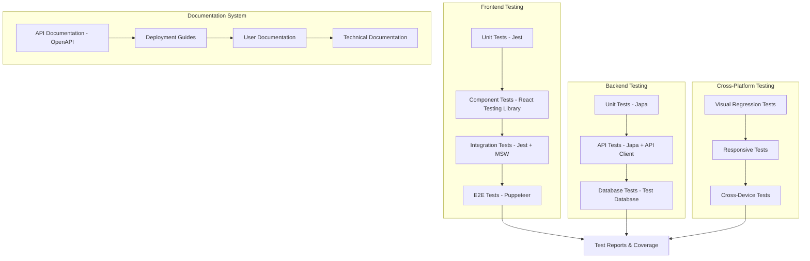

# Testing and Documentation Design

## Overview

การออกแบบระบบ testing และ documentation ที่ครอบคลุมสำหรับโปรเจค Lenovo Tasks ที่ประกอบด้วย Next.js frontend และ AdonisJS backend โดยมุ่งเน้นการสร้าง test suite ที่มีประสิทธิภาพ, E2E testing ที่ครอบคลุม critical flows, และ documentation ที่ชัดเจนสำหรับการ deployment

## Architecture

### Testing Architecture



### Testing Stack

**Frontend Testing:**
- **Jest**: Unit testing framework (already configured)
- **React Testing Library**: Component testing (already configured)
- **Puppeteer**: E2E testing (already available)
- **MSW (Mock Service Worker)**: API mocking for integration tests
- **Jest Coverage**: Code coverage reporting

**Backend Testing:**
- **Japa**: AdonisJS native testing framework (already configured)
- **API Client**: HTTP testing for endpoints
- **Test Database**: Isolated database for testing
- **Factory Pattern**: Test data generation

**Documentation Tools:**
- **Swagger/OpenAPI**: API documentation generation
- **Docusaurus**: Technical documentation site
- **Storybook**: Component documentation
- **Markdown**: Documentation files

## Components and Interfaces

### 1. Frontend Test Suite

#### Unit Test Structure
```typescript
// Component unit tests
interface ComponentTestSuite {
  renderTests: () => void;
  interactionTests: () => void;
  stateTests: () => void;
  propsTests: () => void;
}

// Hook unit tests
interface HookTestSuite {
  initialStateTests: () => void;
  actionTests: () => void;
  sideEffectTests: () => void;
}
```

#### Integration Test Structure
```typescript
interface IntegrationTestSuite {
  apiIntegrationTests: () => void;
  userFlowTests: () => void;
  errorHandlingTests: () => void;
  loadingStateTests: () => void;
}
```

### 2. E2E Test Framework

#### Test Scenarios
```typescript
interface E2ETestScenarios {
  authenticationFlow: {
    login: () => Promise<void>;
    logout: () => Promise<void>;
    roleBasedAccess: () => Promise<void>;
  };
  
  roleManagement: {
    assignRole: () => Promise<void>;
    removeRole: () => Promise<void>;
    permissionValidation: () => Promise<void>;
  };
  
  documentGeneration: {
    createDocument: () => Promise<void>;
    downloadPDF: () => Promise<void>;
    validateContent: () => Promise<void>;
  };
}
```

#### Test Utilities
```typescript
interface E2ETestUtils {
  pageHelpers: {
    login: (credentials: Credentials) => Promise<void>;
    navigateTo: (path: string) => Promise<void>;
    waitForElement: (selector: string) => Promise<void>;
    takeScreenshot: (name: string) => Promise<void>;
  };
  
  dataHelpers: {
    createTestUser: () => Promise<User>;
    cleanupTestData: () => Promise<void>;
    seedTestData: () => Promise<void>;
  };
}
```

### 3. Backend Test Suite

#### API Test Structure
```typescript
interface APITestSuite {
  authenticationTests: () => void;
  userManagementTests: () => void;
  roleManagementTests: () => void;
  documentGenerationTests: () => void;
  errorHandlingTests: () => void;
}
```

#### Database Test Utilities
```typescript
interface DatabaseTestUtils {
  setup: () => Promise<void>;
  teardown: () => Promise<void>;
  seedData: (data: any) => Promise<void>;
  clearData: () => Promise<void>;
}
```

### 4. Documentation System

#### API Documentation Structure
```typescript
interface APIDocumentation {
  endpoints: {
    authentication: OpenAPISpec;
    users: OpenAPISpec;
    roles: OpenAPISpec;
    documents: OpenAPISpec;
  };
  
  schemas: {
    requestSchemas: JSONSchema[];
    responseSchemas: JSONSchema[];
    errorSchemas: JSONSchema[];
  };
  
  examples: {
    requestExamples: Record<string, any>;
    responseExamples: Record<string, any>;
  };
}
```

#### Deployment Documentation Structure
```typescript
interface DeploymentDocumentation {
  prerequisites: string[];
  environmentSetup: string[];
  buildProcess: string[];
  deploymentSteps: string[];
  verification: string[];
  troubleshooting: string[];
}
```

## Data Models

### Test Configuration
```typescript
interface TestConfig {
  frontend: {
    testEnvironment: 'jsdom';
    setupFiles: string[];
    coverageThreshold: {
      global: {
        branches: number;
        functions: number;
        lines: number;
        statements: number;
      };
    };
  };
  
  backend: {
    testEnvironment: 'test';
    database: {
      connection: string;
      migrations: boolean;
      seeders: boolean;
    };
  };
  
  e2e: {
    browser: 'chromium';
    headless: boolean;
    viewport: { width: number; height: number };
    timeout: number;
  };
}
```

### Test Data Models
```typescript
interface TestUser {
  id: string;
  email: string;
  password: string;
  role: 'admin' | 'user' | 'manager';
  permissions: string[];
}

interface TestDocument {
  id: string;
  title: string;
  content: string;
  createdBy: string;
  type: 'pdf' | 'excel';
}
```

### Documentation Models
```typescript
interface DocumentationPage {
  id: string;
  title: string;
  content: string;
  category: 'api' | 'deployment' | 'user-guide' | 'technical';
  lastUpdated: Date;
  version: string;
}
```

## Error Handling

### Test Error Handling
```typescript
interface TestErrorHandling {
  testFailures: {
    captureScreenshot: () => Promise<void>;
    logError: (error: Error) => void;
    retryMechanism: (test: () => Promise<void>, retries: number) => Promise<void>;
  };
  
  testDataCleanup: {
    onFailure: () => Promise<void>;
    onSuccess: () => Promise<void>;
  };
  
  reportGeneration: {
    onTestComplete: () => Promise<void>;
    generateCoverageReport: () => Promise<void>;
  };
}
```

### Documentation Error Handling
```typescript
interface DocumentationErrorHandling {
  outdatedContent: {
    detection: () => boolean;
    notification: () => void;
    updateReminder: () => void;
  };
  
  brokenLinks: {
    detection: () => Promise<string[]>;
    reporting: () => void;
  };
  
  missingDocumentation: {
    detection: () => string[];
    templateGeneration: () => void;
  };
}
```

## Testing Strategy

### 1. Unit Testing Strategy
- **Coverage Target**: 80% minimum for critical components
- **Test Isolation**: Each test should be independent
- **Mock Strategy**: Mock external dependencies and API calls
- **Snapshot Testing**: For UI components to detect unexpected changes

### 2. Integration Testing Strategy
- **API Integration**: Test frontend-backend communication
- **Database Integration**: Test data persistence and retrieval
- **Third-party Integration**: Test external service integrations
- **Error Scenarios**: Test error handling and recovery

### 3. E2E Testing Strategy
- **Critical User Paths**: Focus on main user workflows
- **Cross-browser Testing**: Test on Chrome, Firefox, Safari
- **Mobile Testing**: Test responsive design and mobile interactions
- **Performance Testing**: Monitor page load times and interactions

### 4. Test Data Management
- **Factory Pattern**: Use factories for consistent test data creation
- **Database Seeding**: Automated test data setup
- **Cleanup Strategy**: Automatic cleanup after each test
- **Isolation**: Each test should have its own data set

## Documentation Strategy

### 1. API Documentation
- **OpenAPI Specification**: Auto-generated from code annotations
- **Interactive Documentation**: Swagger UI for API exploration
- **Code Examples**: Include request/response examples
- **Error Documentation**: Document all possible error responses

### 2. Deployment Documentation
- **Environment Setup**: Detailed environment configuration
- **Step-by-step Guides**: Clear deployment instructions
- **Troubleshooting**: Common issues and solutions
- **Rollback Procedures**: How to revert deployments

### 3. User Documentation
- **Getting Started Guide**: Quick start for new users
- **Feature Documentation**: Detailed feature explanations
- **Screenshots**: Visual guides for UI interactions
- **FAQ Section**: Common questions and answers

### 4. Technical Documentation
- **Architecture Overview**: System design and components
- **Code Standards**: Coding conventions and best practices
- **Contributing Guide**: How to contribute to the project
- **Changelog**: Version history and changes

## Implementation Approach

### Phase 1: Test Infrastructure Setup
1. Configure Jest and React Testing Library for comprehensive frontend testing
2. Set up Japa testing framework for backend API testing
3. Configure Puppeteer for E2E testing with proper test data management
4. Implement test database setup and teardown procedures

### Phase 2: Core Test Suite Development
1. Develop unit tests for critical components and functions
2. Create integration tests for API endpoints and user workflows
3. Implement E2E tests for authentication, role management, and document generation
4. Set up continuous integration pipeline for automated testing

### Phase 3: Documentation System
1. Set up OpenAPI documentation generation from code
2. Create deployment guides with step-by-step instructions
3. Develop user documentation with screenshots and examples
4. Implement documentation versioning and update tracking

### Phase 4: Advanced Testing Features
1. Implement visual regression testing for UI consistency
2. Add performance testing and monitoring
3. Create cross-device and responsive testing suite
4. Set up automated test reporting and notifications

## Performance Considerations

### Test Performance
- **Parallel Execution**: Run tests in parallel where possible
- **Test Optimization**: Minimize test setup and teardown time
- **Selective Testing**: Run only affected tests during development
- **Caching**: Cache test dependencies and build artifacts

### Documentation Performance
- **Static Generation**: Generate static documentation for fast loading
- **CDN Delivery**: Use CDN for documentation assets
- **Search Optimization**: Implement fast search functionality
- **Mobile Optimization**: Ensure documentation works well on mobile devices

## Security Considerations

### Test Security
- **Test Data Isolation**: Ensure test data doesn't leak to production
- **Credential Management**: Secure handling of test credentials
- **Environment Separation**: Strict separation between test and production
- **Sensitive Data**: Avoid real sensitive data in tests

### Documentation Security
- **Access Control**: Restrict access to internal documentation
- **Sensitive Information**: Avoid exposing sensitive system details
- **Version Control**: Track documentation changes and access
- **Regular Reviews**: Regular security reviews of documentation content