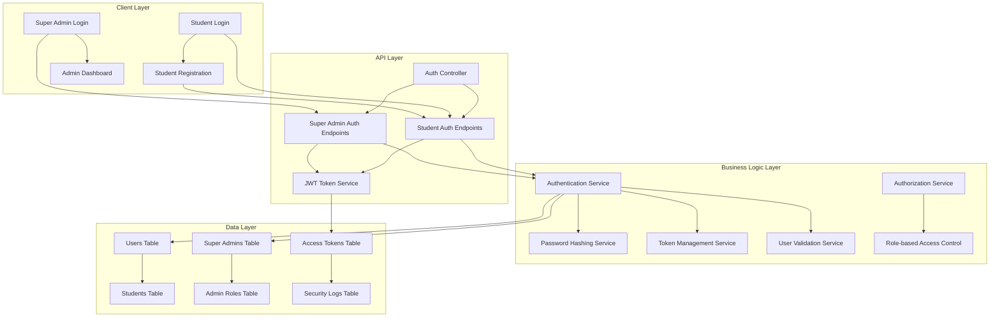
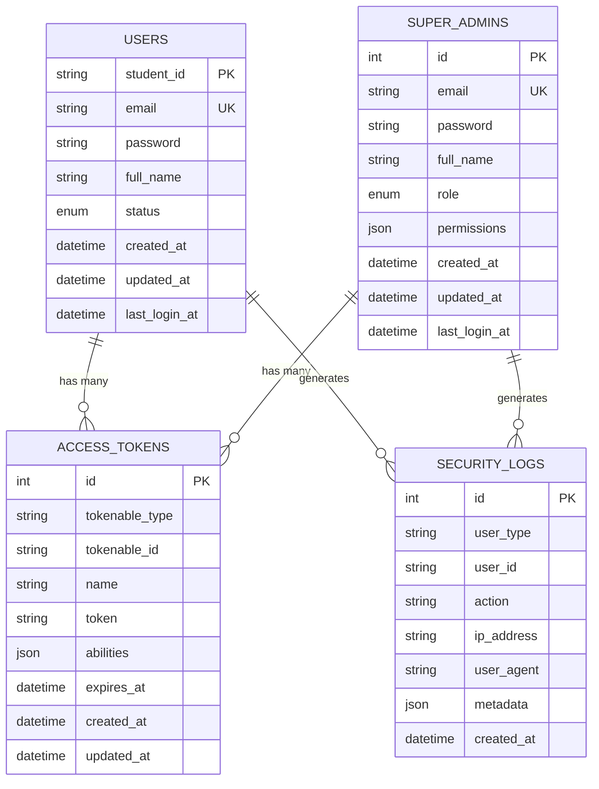

# Authentication System Enhancement Design

## Overview

การออกแบบระบบ authentication ที่ปรับปรุงให้รองรับการใช้ student_id เป็น primary identifier สำหรับนักศึกษา พร้อมระบบ Super Admin แยกต่างหาก โดยใช้ Node.js + Express.js + TypeScript และ MySQL database พร้อมการรักษาความปลอดภัยที่แข็งแกร่ง

## Architecture

### Authentication System Architecture



### Database Schema Architecture



## Components and Interfaces

### 1. Enhanced Authentication Controller

#### Student Authentication Interface
```typescript
interface StudentAuthController {
  register(context: HttpContext): Promise<StudentRegistrationResponse>;
  login(context: HttpContext): Promise<StudentLoginResponse>;
  logout(context: HttpContext): Promise<void>;
  refreshToken(context: HttpContext): Promise<TokenRefreshResponse>;
  forgotPassword(context: HttpContext): Promise<void>;
  resetPassword(context: HttpContext): Promise<void>;
}

interface StudentRegistrationRequest {
  student_id: string;
  email: string;
  password: string;
  full_name: string;
  confirm_password: string;
}

interface StudentLoginRequest {
  student_id: string;
  password: string;
  remember_me?: boolean;
}

interface StudentLoginResponse {
  user: StudentUser;
  token: AccessToken;
  expires_at: string;
  permissions: string[];
}
```

#### Super Admin Authentication Interface
```typescript
interface SuperAdminAuthController {
  login(context: HttpContext): Promise<SuperAdminLoginResponse>;
  logout(context: HttpContext): Promise<void>;
  refreshToken(context: HttpContext): Promise<TokenRefreshResponse>;
  changePassword(context: HttpContext): Promise<void>;
  createAdmin(context: HttpContext): Promise<SuperAdminCreateResponse>;
}

interface SuperAdminLoginRequest {
  email: string;
  password: string;
  two_factor_code?: string;
}

interface SuperAdminLoginResponse {
  admin: SuperAdmin;
  token: AccessToken;
  expires_at: string;
  permissions: string[];
  role: AdminRole;
}
```

### 2. Enhanced User Models

#### Student User Model
```typescript
interface StudentUser extends BaseModel {
  student_id: string; // Primary Key
  email: string; // Unique
  password: string;
  full_name: string;
  status: 'active' | 'inactive' | 'suspended';
  email_verified_at: DateTime | null;
  last_login_at: DateTime | null;
  created_at: DateTime;
  updated_at: DateTime;
  
  // Relationships
  accessTokens: HasMany<typeof AccessToken>;
  securityLogs: HasMany<typeof SecurityLog>;
  
  // Methods
  verifyPassword(password: string): Promise<boolean>;
  generateAccessToken(abilities?: string[]): Promise<AccessToken>;
  hasPermission(permission: string): Promise<boolean>;
}
```

#### Super Admin Model
```typescript
interface SuperAdmin extends BaseModel {
  id: number; // Primary Key
  email: string; // Unique
  password: string;
  full_name: string;
  role: 'super_admin' | 'system_admin' | 'content_admin';
  permissions: string[];
  two_factor_enabled: boolean;
  two_factor_secret: string | null;
  last_login_at: DateTime | null;
  created_at: DateTime;
  updated_at: DateTime;
  
  // Relationships
  accessTokens: HasMany<typeof AccessToken>;
  securityLogs: HasMany<typeof SecurityLog>;
  
  // Methods
  verifyPassword(password: string): Promise<boolean>;
  verifyTwoFactor(code: string): Promise<boolean>;
  generateAccessToken(abilities?: string[]): Promise<AccessToken>;
  hasPermission(permission: string): boolean;
}
```

### 3. Authentication Services

#### Password Security Service
```typescript
interface PasswordSecurityService {
  hashPassword(password: string): Promise<string>;
  verifyPassword(password: string, hash: string): Promise<boolean>;
  validatePasswordStrength(password: string): PasswordStrengthResult;
  generateSecurePassword(length?: number): string;
}

interface PasswordStrengthResult {
  isValid: boolean;
  score: number; // 0-4
  feedback: string[];
  requirements: {
    minLength: boolean;
    hasUppercase: boolean;
    hasLowercase: boolean;
    hasNumbers: boolean;
    hasSpecialChars: boolean;
  };
}
```

#### JWT Token Service
```typescript
interface JWTTokenService {
  generateToken(user: StudentUser | SuperAdmin, abilities?: string[]): Promise<AccessToken>;
  verifyToken(token: string): Promise<TokenVerificationResult>;
  refreshToken(refreshToken: string): Promise<AccessToken>;
  revokeToken(token: string): Promise<void>;
  revokeAllTokens(user: StudentUser | SuperAdmin): Promise<void>;
}

interface TokenVerificationResult {
  isValid: boolean;
  user: StudentUser | SuperAdmin | null;
  abilities: string[];
  expiresAt: DateTime;
  error?: string;
}

interface AccessToken extends BaseModel {
  id: number;
  tokenable_type: string;
  tokenable_id: string;
  name: string;
  token: string;
  abilities: string[];
  expires_at: DateTime;
  last_used_at: DateTime | null;
  created_at: DateTime;
  updated_at: DateTime;
}
```

### 4. Validation Services

#### Student ID Validation Service
```typescript
interface StudentIdValidationService {
  validateFormat(studentId: string): ValidationResult;
  checkUniqueness(studentId: string): Promise<boolean>;
  generateStudentId(): string;
  parseStudentId(studentId: string): StudentIdInfo;
}

interface StudentIdInfo {
  year: string;
  faculty: string;
  department: string;
  sequence: string;
  isValid: boolean;
}

interface ValidationResult {
  isValid: boolean;
  errors: string[];
  warnings: string[];
}
```

#### Email Validation Service
```typescript
interface EmailValidationService {
  validateFormat(email: string): boolean;
  checkUniqueness(email: string, userType: 'student' | 'admin'): Promise<boolean>;
  validateDomain(email: string): Promise<DomainValidationResult>;
  sendVerificationEmail(user: StudentUser): Promise<void>;
  verifyEmail(token: string): Promise<boolean>;
}

interface DomainValidationResult {
  isValid: boolean;
  isEducational: boolean;
  isDisposable: boolean;
  domain: string;
  suggestions: string[];
}
```

## Data Models

### Database Schema Models
```typescript
// Users table for students
interface UsersTable {
  student_id: string; // VARCHAR(20) PRIMARY KEY
  email: string; // VARCHAR(255) UNIQUE NOT NULL
  password: string; // VARCHAR(255) NOT NULL
  full_name: string; // VARCHAR(255) NOT NULL
  status: 'active' | 'inactive' | 'suspended'; // ENUM DEFAULT 'active'
  email_verified_at: Date | null; // TIMESTAMP NULL
  last_login_at: Date | null; // TIMESTAMP NULL
  created_at: Date; // TIMESTAMP DEFAULT CURRENT_TIMESTAMP
  updated_at: Date; // TIMESTAMP DEFAULT CURRENT_TIMESTAMP ON UPDATE CURRENT_TIMESTAMP
}

// Super admins table
interface SuperAdminsTable {
  id: number; // INT AUTO_INCREMENT PRIMARY KEY
  email: string; // VARCHAR(255) UNIQUE NOT NULL
  password: string; // VARCHAR(255) NOT NULL
  full_name: string; // VARCHAR(255) NOT NULL
  role: 'super_admin' | 'system_admin' | 'content_admin'; // ENUM DEFAULT 'system_admin'
  permissions: string[]; // JSON
  two_factor_enabled: boolean; // BOOLEAN DEFAULT FALSE
  two_factor_secret: string | null; // VARCHAR(255) NULL
  last_login_at: Date | null; // TIMESTAMP NULL
  created_at: Date; // TIMESTAMP DEFAULT CURRENT_TIMESTAMP
  updated_at: Date; // TIMESTAMP DEFAULT CURRENT_TIMESTAMP ON UPDATE CURRENT_TIMESTAMP
}
```

### Request/Response Models
```typescript
interface AuthenticationRequest {
  identifier: string; // student_id or email
  password: string;
  remember_me?: boolean;
  device_info?: DeviceInfo;
}

interface AuthenticationResponse {
  success: boolean;
  user: StudentUser | SuperAdmin;
  token: string;
  refresh_token: string;
  expires_at: string;
  permissions: string[];
  message?: string;
}

interface DeviceInfo {
  device_type: 'web' | 'mobile' | 'tablet';
  browser: string;
  os: string;
  ip_address: string;
  user_agent: string;
}
```

## Error Handling

### Authentication Error Types
```typescript
enum AuthenticationError {
  INVALID_CREDENTIALS = 'INVALID_CREDENTIALS',
  USER_NOT_FOUND = 'USER_NOT_FOUND',
  USER_INACTIVE = 'USER_INACTIVE',
  USER_SUSPENDED = 'USER_SUSPENDED',
  EMAIL_NOT_VERIFIED = 'EMAIL_NOT_VERIFIED',
  TOKEN_EXPIRED = 'TOKEN_EXPIRED',
  TOKEN_INVALID = 'TOKEN_INVALID',
  RATE_LIMIT_EXCEEDED = 'RATE_LIMIT_EXCEEDED',
  TWO_FACTOR_REQUIRED = 'TWO_FACTOR_REQUIRED',
  TWO_FACTOR_INVALID = 'TWO_FACTOR_INVALID',
}

interface AuthenticationErrorHandler {
  handleError(error: AuthenticationError, context: HttpContext): Response;
  logSecurityEvent(error: AuthenticationError, context: HttpContext): Promise<void>;
  shouldBlockIP(ip: string, error: AuthenticationError): Promise<boolean>;
  sendSecurityAlert(error: AuthenticationError, user: StudentUser | SuperAdmin): Promise<void>;
}
```

### Validation Error Handling
```typescript
interface ValidationErrorResponse {
  success: false;
  message: string;
  errors: {
    field: string;
    message: string;
    code: string;
  }[];
  suggestions?: string[];
}

interface ValidationErrorMessages {
  student_id: {
    required: "รหัสนักศึกษาจำเป็นต้องกรอก";
    invalid_format: "รูปแบบรหัสนักศึกษาไม่ถูกต้อง";
    already_exists: "รหัสนักศึกษานี้ถูกใช้งานแล้ว";
    min_length: "รหัสนักศึกษาต้องมีอย่างน้อย 8 หลัก";
    max_length: "รหัสนักศึกษาต้องไม่เกิน 20 หลัก";
  };
  
  email: {
    required: "อีเมลจำเป็นต้องกรอก";
    invalid_format: "รูปแบบอีเมลไม่ถูกต้อง";
    already_exists: "อีเมลนี้ถูกใช้งานแล้ว";
    domain_not_allowed: "โดเมนอีเมลนี้ไม่ได้รับอนุญาต";
  };
  
  password: {
    required: "รหัสผ่านจำเป็นต้องกรอก";
    too_weak: "รหัสผ่านไม่ปลอดภัยเพียงพอ";
    min_length: "รหัสผ่านต้องมีอย่างน้อย 8 ตัวอักษร";
    no_uppercase: "รหัสผ่านต้องมีตัวอักษรพิมพ์ใหญ่";
    no_lowercase: "รหัสผ่านต้องมีตัวอักษรพิมพ์เล็ก";
    no_numbers: "รหัสผ่านต้องมีตัวเลข";
    no_special_chars: "รหัสผ่านต้องมีอักขระพิเศษ";
  };
}
```

## Security Implementation

### Password Security
```typescript
interface PasswordSecurityConfig {
  hashing: {
    algorithm: 'bcrypt';
    rounds: 12;
    pepper?: string;
  };
  
  validation: {
    minLength: 8;
    maxLength: 128;
    requireUppercase: true;
    requireLowercase: true;
    requireNumbers: true;
    requireSpecialChars: true;
    forbiddenPasswords: string[];
  };
  
  policies: {
    maxAge: 90; // days
    preventReuse: 5; // last N passwords
    lockoutThreshold: 5; // failed attempts
    lockoutDuration: 30; // minutes
  };
}
```

### JWT Security Configuration
```typescript
interface JWTSecurityConfig {
  algorithm: 'HS256' | 'RS256';
  secretKey: string;
  publicKey?: string;
  privateKey?: string;
  
  tokenLifetime: {
    access: 15; // minutes
    refresh: 7; // days
    remember: 30; // days
  };
  
  claims: {
    issuer: string;
    audience: string;
    subject: string;
  };
  
  security: {
    enableJTI: boolean; // JWT ID for revocation
    enableNBF: boolean; // Not Before claim
    clockTolerance: 30; // seconds
  };
}
```

### Rate Limiting and Security
```typescript
interface SecurityConfig {
  rateLimiting: {
    login: {
      maxAttempts: 5;
      windowMs: 15 * 60 * 1000; // 15 minutes
      blockDuration: 30 * 60 * 1000; // 30 minutes
    };
    
    registration: {
      maxAttempts: 3;
      windowMs: 60 * 60 * 1000; // 1 hour
      blockDuration: 24 * 60 * 60 * 1000; // 24 hours
    };
  };
  
  ipBlocking: {
    enabled: boolean;
    maxFailedAttempts: 10;
    blockDuration: 60 * 60 * 1000; // 1 hour
    whitelist: string[];
  };
  
  sessionSecurity: {
    secureCookies: boolean;
    sameSite: 'strict' | 'lax' | 'none';
    httpOnly: boolean;
    maxAge: number;
  };
}
```

## API Endpoints Design

### Student Authentication Endpoints
```typescript
interface StudentAuthEndpoints {
  'POST /api/auth/student/register': {
    body: StudentRegistrationRequest;
    response: StudentRegistrationResponse;
  };
  
  'POST /api/auth/student/login': {
    body: StudentLoginRequest;
    response: StudentLoginResponse;
  };
  
  'POST /api/auth/student/logout': {
    headers: { Authorization: string };
    response: { success: boolean };
  };
  
  'POST /api/auth/student/refresh': {
    body: { refresh_token: string };
    response: TokenRefreshResponse;
  };
  
  'POST /api/auth/student/forgot-password': {
    body: { email: string };
    response: { success: boolean; message: string };
  };
  
  'POST /api/auth/student/reset-password': {
    body: { token: string; password: string; confirm_password: string };
    response: { success: boolean; message: string };
  };
}
```

### Super Admin Authentication Endpoints
```typescript
interface SuperAdminAuthEndpoints {
  'POST /api/auth/admin/login': {
    body: SuperAdminLoginRequest;
    response: SuperAdminLoginResponse;
  };
  
  'POST /api/auth/admin/logout': {
    headers: { Authorization: string };
    response: { success: boolean };
  };
  
  'POST /api/auth/admin/refresh': {
    body: { refresh_token: string };
    response: TokenRefreshResponse;
  };
  
  'POST /api/auth/admin/change-password': {
    headers: { Authorization: string };
    body: { current_password: string; new_password: string };
    response: { success: boolean };
  };
  
  'POST /api/auth/admin/enable-2fa': {
    headers: { Authorization: string };
    response: { secret: string; qr_code: string };
  };
  
  'POST /api/auth/admin/verify-2fa': {
    headers: { Authorization: string };
    body: { code: string };
    response: { success: boolean };
  };
}
```

## Database Migration Strategy

### Migration Plan
```typescript
interface MigrationPlan {
  phase1: {
    description: "Create new tables with student_id as primary key";
    migrations: [
      "create_users_with_student_id_table",
      "create_super_admins_table",
      "create_enhanced_access_tokens_table",
      "create_security_logs_table"
    ];
  };
  
  phase2: {
    description: "Migrate existing data";
    migrations: [
      "migrate_existing_users_data",
      "update_foreign_key_references",
      "create_admin_accounts"
    ];
  };
  
  phase3: {
    description: "Clean up and optimize";
    migrations: [
      "drop_old_tables",
      "add_indexes_and_constraints",
      "optimize_table_structure"
    ];
  };
}
```

### Data Migration Scripts
```sql
-- Create new users table with student_id as primary key
CREATE TABLE users_new (
  student_id VARCHAR(20) PRIMARY KEY,
  email VARCHAR(255) UNIQUE NOT NULL,
  password VARCHAR(255) NOT NULL,
  full_name VARCHAR(255) NOT NULL,
  status ENUM('active', 'inactive', 'suspended') DEFAULT 'active',
  email_verified_at TIMESTAMP NULL,
  last_login_at TIMESTAMP NULL,
  created_at TIMESTAMP DEFAULT CURRENT_TIMESTAMP,
  updated_at TIMESTAMP DEFAULT CURRENT_TIMESTAMP ON UPDATE CURRENT_TIMESTAMP,
  
  INDEX idx_email (email),
  INDEX idx_status (status),
  INDEX idx_created_at (created_at)
);

-- Create super_admins table
CREATE TABLE super_admins (
  id INT AUTO_INCREMENT PRIMARY KEY,
  email VARCHAR(255) UNIQUE NOT NULL,
  password VARCHAR(255) NOT NULL,
  full_name VARCHAR(255) NOT NULL,
  role ENUM('super_admin', 'system_admin', 'content_admin') DEFAULT 'system_admin',
  permissions JSON,
  two_factor_enabled BOOLEAN DEFAULT FALSE,
  two_factor_secret VARCHAR(255) NULL,
  last_login_at TIMESTAMP NULL,
  created_at TIMESTAMP DEFAULT CURRENT_TIMESTAMP,
  updated_at TIMESTAMP DEFAULT CURRENT_TIMESTAMP ON UPDATE CURRENT_TIMESTAMP,
  
  INDEX idx_email (email),
  INDEX idx_role (role),
  INDEX idx_created_at (created_at)
);
```

## Performance Considerations

### Database Performance
```typescript
interface DatabasePerformanceOptimization {
  indexing: {
    primaryKeys: ['student_id', 'admin.id'];
    uniqueKeys: ['email'];
    searchIndexes: ['status', 'role', 'created_at'];
    compositeIndexes: [
      ['email', 'status'],
      ['student_id', 'last_login_at']
    ];
  };
  
  queryOptimization: {
    useSelectiveFields: boolean;
    implementQueryCaching: boolean;
    optimizeJoins: boolean;
    usePreparedStatements: boolean;
  };
  
  connectionPooling: {
    minConnections: 5;
    maxConnections: 20;
    acquireTimeoutMs: 30000;
    idleTimeoutMs: 600000;
  };
}
```

### Caching Strategy
```typescript
interface CachingStrategy {
  userSessions: {
    provider: 'redis' | 'memory';
    ttl: 900; // 15 minutes
    maxSize: 10000;
  };
  
  tokenBlacklist: {
    provider: 'redis';
    ttl: 86400; // 24 hours
    cleanupInterval: 3600; // 1 hour
  };
  
  rateLimitCounters: {
    provider: 'redis';
    ttl: 3600; // 1 hour
    slidingWindow: boolean;
  };
}
```

## Implementation Approach

### Phase 1: Database Schema Migration
1. Create new database tables with student_id as primary key
2. Set up super_admins table with proper permissions structure
3. Create enhanced access_tokens table with better security features
4. Implement security_logs table for audit trail

### Phase 2: Core Authentication Services
1. Build enhanced password hashing and validation services
2. Implement JWT token generation and verification services
3. Create student ID validation and formatting services
4. Build email validation and verification services

### Phase 3: API Controllers and Endpoints
1. Create separate authentication controllers for students and admins
2. Implement comprehensive input validation and sanitization
3. Add proper error handling and security logging
4. Build rate limiting and IP blocking mechanisms

### Phase 4: Security Enhancements
1. Implement two-factor authentication for super admins
2. Add comprehensive audit logging and monitoring
3. Create security alert and notification systems
4. Implement advanced threat detection and prevention

### Phase 5: Testing and Optimization
1. Create comprehensive test suite for all authentication flows
2. Implement performance testing and optimization
3. Add security penetration testing
4. Create monitoring and alerting systems

### Phase 6: Migration and Deployment
1. Plan and execute data migration from existing system
2. Implement rollback procedures and contingency plans
3. Create deployment scripts and automation
4. Set up monitoring and health checks for production