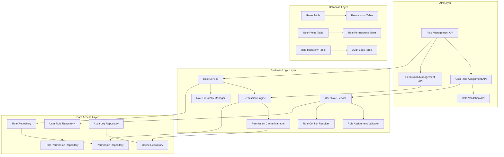
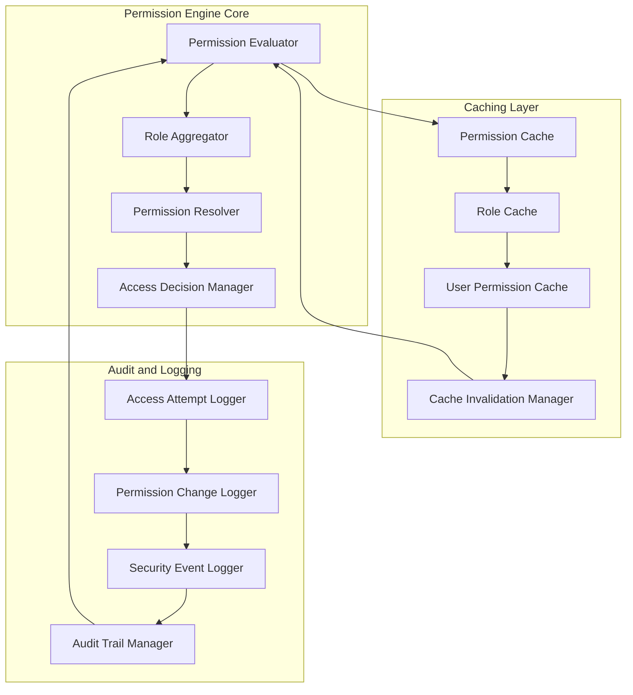

# User Role Management System Design

## Overview

การออกแบบระบบจัดการ user roles ที่ซับซ้อนและยืดหยุ่น รองรับการกำหนด multiple roles ต่อ user, hierarchical role structure, และ dynamic permission matrix engine พร้อมระบบ caching และ audit logging ที่มีประสิทธิภาพ

## Architecture

### Role Management System Architecture



### Permission Matrix Engine Architecture



## Components and Interfaces

### 1. Enhanced Role Model and Service

#### Role Model Interface
```typescript
interface Role extends BaseModel {
  id: number;
  name: string;
  display_name: string;
  description: string;
  level: number; // For hierarchy
  parent_id: number | null; // For hierarchical roles
  is_system: boolean; // System roles cannot be deleted
  max_assignments: number; // Max users that can have this role
  faculty_limit: number; // Max roles per faculty (default 3)
  is_active: boolean;
  metadata: Record<string, any>;
  created_at: DateTime;
  updated_at: DateTime;
  
  // Relationships
  parent: BelongsTo<typeof Role>;
  children: HasMany<typeof Role>;
  permissions: ManyToMany<typeof Permission>;
  userRoles: HasMany<typeof UserRole>;
  users: ManyToMany<typeof User>;
  
  // Methods
  hasPermission(permission: string): Promise<boolean>;
  getInheritedPermissions(): Promise<Permission[]>;
  getAllPermissions(): Promise<Permission[]>;
  canAssignToUser(userId: string): Promise<boolean>;
  getConflictingRoles(): Promise<Role[]>;
}
```

#### Role Service Interface
```typescript
interface RoleService {
  createRole(data: CreateRoleDTO): Promise<Role>;
  updateRole(id: number, data: UpdateRoleDTO): Promise<Role>;
  deleteRole(id: number): Promise<void>;
  getRoleHierarchy(): Promise<RoleHierarchy>;
  validateRoleAssignment(userId: string, roleIds: number[]): Promise<ValidationResult>;
  resolveRoleConflicts(userId: string, roleIds: number[]): Promise<ConflictResolution>;
  assignPermissionsToRole(roleId: number, permissionIds: number[]): Promise<void>;
  removePermissionsFromRole(roleId: number, permissionIds: number[]): Promise<void>;
  cloneRole(sourceRoleId: number, newRoleName: string): Promise<Role>;
}

interface CreateRoleDTO {
  name: string;
  display_name: string;
  description?: string;
  parent_id?: number;
  level?: number;
  max_assignments?: number;
  faculty_limit?: number;
  permissions?: number[];
  metadata?: Record<string, any>;
}

interface RoleHierarchy {
  roles: Role[];
  relationships: RoleRelationship[];
  maxDepth: number;
}

interface RoleRelationship {
  parent: Role;
  children: Role[];
  depth: number;
}
```

### 2. Permission System

#### Permission Model Interface
```typescript
interface Permission extends BaseModel {
  id: number;
  name: string; // e.g., "users.create", "reports.view"
  display_name: string;
  description: string;
  module: string; // e.g., "users", "reports", "settings"
  action: string; // e.g., "create", "read", "update", "delete"
  resource?: string; // Optional resource specification
  conditions?: PermissionCondition[]; // Conditional permissions
  is_system: boolean;
  is_active: boolean;
  created_at: DateTime;
  updated_at: DateTime;
  
  // Relationships
  roles: ManyToMany<typeof Role>;
  
  // Methods
  matches(requiredPermission: string): boolean;
  evaluateConditions(context: PermissionContext): boolean;
}

interface PermissionCondition {
  type: 'user_attribute' | 'resource_attribute' | 'time_based' | 'location_based';
  field: string;
  operator: 'equals' | 'not_equals' | 'in' | 'not_in' | 'greater_than' | 'less_than';
  value: any;
  description: string;
}

interface PermissionContext {
  user: User;
  resource?: any;
  action: string;
  timestamp: DateTime;
  ip_address?: string;
  additional_data?: Record<string, any>;
}
```

#### Permission Engine Interface
```typescript
interface PermissionEngine {
  checkPermission(userId: string, permission: string, context?: PermissionContext): Promise<boolean>;
  getUserPermissions(userId: string): Promise<string[]>;
  getRolePermissions(roleId: number): Promise<string[]>;
  evaluatePermissionMatrix(userId: string): Promise<PermissionMatrix>;
  invalidateUserPermissions(userId: string): Promise<void>;
  invalidateRolePermissions(roleId: number): Promise<void>;
  bulkCheckPermissions(userId: string, permissions: string[]): Promise<Record<string, boolean>>;
  getPermissionTree(): Promise<PermissionTree>;
}

interface PermissionMatrix {
  userId: string;
  roles: Role[];
  permissions: PermissionEntry[];
  computed_at: DateTime;
  expires_at: DateTime;
}

interface PermissionEntry {
  permission: string;
  granted: boolean;
  source: 'direct' | 'inherited' | 'conditional';
  role_id?: number;
  conditions?: PermissionCondition[];
}

interface PermissionTree {
  modules: PermissionModule[];
  total_permissions: number;
  last_updated: DateTime;
}

interface PermissionModule {
  name: string;
  display_name: string;
  actions: PermissionAction[];
  sub_modules: PermissionModule[];
}

interface PermissionAction {
  name: string;
  display_name: string;
  description: string;
  required_level: number;
}
```

### 3. User Role Management

#### User Role Model Interface
```typescript
interface UserRole extends BaseModel {
  id: number;
  user_id: string; // References student_id from users table
  role_id: number;
  assigned_by: string; // Who assigned this role
  assigned_at: DateTime;
  expires_at: DateTime | null; // Optional expiration
  is_active: boolean;
  faculty_context?: string; // Faculty-specific role assignment
  metadata: Record<string, any>;
  created_at: DateTime;
  updated_at: DateTime;
  
  // Relationships
  user: BelongsTo<typeof User>;
  role: BelongsTo<typeof Role>;
  assignedBy: BelongsTo<typeof User>;
  
  // Methods
  isExpired(): boolean;
  canBeModifiedBy(userId: string): Promise<boolean>;
  getEffectivePermissions(): Promise<string[]>;
}
```

#### User Role Service Interface
```typescript
interface UserRoleService {
  assignRoleToUser(userId: string, roleId: number, assignedBy: string, options?: AssignmentOptions): Promise<UserRole>;
  removeRoleFromUser(userId: string, roleId: number, removedBy: string): Promise<void>;
  getUserRoles(userId: string, includeExpired?: boolean): Promise<UserRole[]>;
  getUsersWithRole(roleId: number): Promise<User[]>;
  validateRoleAssignment(userId: string, roleId: number): Promise<ValidationResult>;
  bulkAssignRoles(assignments: BulkRoleAssignment[]): Promise<BulkOperationResult>;
  bulkRemoveRoles(removals: BulkRoleRemoval[]): Promise<BulkOperationResult>;
  transferRoles(fromUserId: string, toUserId: string, roleIds: number[]): Promise<void>;
  getAssignmentHistory(userId: string): Promise<RoleAssignmentHistory[]>;
}

interface AssignmentOptions {
  expires_at?: DateTime;
  faculty_context?: string;
  metadata?: Record<string, any>;
  notify_user?: boolean;
}

interface BulkRoleAssignment {
  user_id: string;
  role_id: number;
  assigned_by: string;
  options?: AssignmentOptions;
}

interface BulkOperationResult {
  successful: number;
  failed: number;
  errors: BulkOperationError[];
  results: any[];
}

interface BulkOperationError {
  user_id: string;
  role_id: number;
  error: string;
  code: string;
}
```

### 4. Role Validation and Conflict Resolution

#### Role Validator Interface
```typescript
interface RoleValidator {
  validateRoleAssignment(userId: string, roleId: number): Promise<ValidationResult>;
  validateMultipleRoleAssignment(userId: string, roleIds: number[]): Promise<ValidationResult>;
  checkFacultyLimits(userId: string, roleId: number): Promise<boolean>;
  checkRoleCompatibility(roleIds: number[]): Promise<CompatibilityResult>;
  validateRoleHierarchy(parentId: number, childId: number): Promise<boolean>;
  checkMaxAssignments(roleId: number): Promise<boolean>;
}

interface ValidationResult {
  isValid: boolean;
  errors: ValidationError[];
  warnings: ValidationWarning[];
  suggestions: string[];
}

interface ValidationError {
  code: string;
  message: string;
  field?: string;
  context?: Record<string, any>;
}

interface ValidationWarning {
  code: string;
  message: string;
  severity: 'low' | 'medium' | 'high';
  context?: Record<string, any>;
}

interface CompatibilityResult {
  compatible: boolean;
  conflicts: RoleConflict[];
  resolutions: ConflictResolution[];
}

interface RoleConflict {
  type: 'permission_overlap' | 'hierarchy_violation' | 'faculty_limit' | 'business_rule';
  role1: Role;
  role2: Role;
  description: string;
  severity: 'error' | 'warning';
  auto_resolvable: boolean;
}

interface ConflictResolution {
  conflict: RoleConflict;
  resolution_type: 'remove_role' | 'modify_permissions' | 'change_hierarchy' | 'manual_review';
  description: string;
  auto_apply: boolean;
  consequences: string[];
}
```

## Data Models

### Database Schema Models
```typescript
// Enhanced roles table
interface RolesTable {
  id: number; // INT AUTO_INCREMENT PRIMARY KEY
  name: string; // VARCHAR(100) UNIQUE NOT NULL
  display_name: string; // VARCHAR(255) NOT NULL
  description: string; // TEXT NULL
  level: number; // INT DEFAULT 0 (for hierarchy)
  parent_id: number | null; // INT NULL REFERENCES roles(id)
  is_system: boolean; // BOOLEAN DEFAULT FALSE
  max_assignments: number; // INT DEFAULT -1 (unlimited)
  faculty_limit: number; // INT DEFAULT 3
  is_active: boolean; // BOOLEAN DEFAULT TRUE
  metadata: string; // JSON NULL
  created_at: Date; // TIMESTAMP DEFAULT CURRENT_TIMESTAMP
  updated_at: Date; // TIMESTAMP DEFAULT CURRENT_TIMESTAMP ON UPDATE CURRENT_TIMESTAMP
}

// Enhanced permissions table
interface PermissionsTable {
  id: number; // INT AUTO_INCREMENT PRIMARY KEY
  name: string; // VARCHAR(255) UNIQUE NOT NULL (e.g., "users.create")
  display_name: string; // VARCHAR(255) NOT NULL
  description: string; // TEXT NULL
  module: string; // VARCHAR(100) NOT NULL
  action: string; // VARCHAR(100) NOT NULL
  resource: string; // VARCHAR(100) NULL
  conditions: string; // JSON NULL
  is_system: boolean; // BOOLEAN DEFAULT FALSE
  is_active: boolean; // BOOLEAN DEFAULT TRUE
  created_at: Date; // TIMESTAMP DEFAULT CURRENT_TIMESTAMP
  updated_at: Date; // TIMESTAMP DEFAULT CURRENT_TIMESTAMP ON UPDATE CURRENT_TIMESTAMP
}

// Enhanced user_roles table
interface UserRolesTable {
  id: number; // INT AUTO_INCREMENT PRIMARY KEY
  user_id: string; // VARCHAR(20) NOT NULL REFERENCES users(student_id)
  role_id: number; // INT NOT NULL REFERENCES roles(id)
  assigned_by: string; // VARCHAR(20) NOT NULL REFERENCES users(student_id)
  assigned_at: Date; // TIMESTAMP DEFAULT CURRENT_TIMESTAMP
  expires_at: Date | null; // TIMESTAMP NULL
  is_active: boolean; // BOOLEAN DEFAULT TRUE
  faculty_context: string; // VARCHAR(100) NULL
  metadata: string; // JSON NULL
  created_at: Date; // TIMESTAMP DEFAULT CURRENT_TIMESTAMP
  updated_at: Date; // TIMESTAMP DEFAULT CURRENT_TIMESTAMP ON UPDATE CURRENT_TIMESTAMP
}

// Role permissions junction table
interface RolePermissionsTable {
  id: number; // INT AUTO_INCREMENT PRIMARY KEY
  role_id: number; // INT NOT NULL REFERENCES roles(id)
  permission_id: number; // INT NOT NULL REFERENCES permissions(id)
  granted: boolean; // BOOLEAN DEFAULT TRUE
  conditions: string; // JSON NULL (additional conditions)
  assigned_by: string; // VARCHAR(20) NOT NULL
  assigned_at: Date; // TIMESTAMP DEFAULT CURRENT_TIMESTAMP
  created_at: Date; // TIMESTAMP DEFAULT CURRENT_TIMESTAMP
  updated_at: Date; // TIMESTAMP DEFAULT CURRENT_TIMESTAMP ON UPDATE CURRENT_TIMESTAMP
}
```

### Caching Models
```typescript
interface PermissionCacheEntry {
  key: string; // user_id or role_id based cache key
  permissions: string[];
  roles: number[];
  computed_at: DateTime;
  expires_at: DateTime;
  version: number;
}

interface RoleCacheEntry {
  role_id: number;
  role_data: Role;
  permissions: Permission[];
  hierarchy: RoleHierarchy;
  cached_at: DateTime;
  expires_at: DateTime;
}
```

## Error Handling

### Role Management Errors
```typescript
enum RoleManagementError {
  ROLE_NOT_FOUND = 'ROLE_NOT_FOUND',
  ROLE_ALREADY_EXISTS = 'ROLE_ALREADY_EXISTS',
  ROLE_IN_USE = 'ROLE_IN_USE',
  SYSTEM_ROLE_MODIFICATION = 'SYSTEM_ROLE_MODIFICATION',
  INVALID_ROLE_HIERARCHY = 'INVALID_ROLE_HIERARCHY',
  CIRCULAR_HIERARCHY = 'CIRCULAR_HIERARCHY',
  MAX_ASSIGNMENTS_EXCEEDED = 'MAX_ASSIGNMENTS_EXCEEDED',
  FACULTY_LIMIT_EXCEEDED = 'FACULTY_LIMIT_EXCEEDED',
  ROLE_CONFLICT = 'ROLE_CONFLICT',
  PERMISSION_NOT_FOUND = 'PERMISSION_NOT_FOUND',
  INSUFFICIENT_PERMISSIONS = 'INSUFFICIENT_PERMISSIONS',
  INVALID_ASSIGNMENT = 'INVALID_ASSIGNMENT',
  ASSIGNMENT_EXPIRED = 'ASSIGNMENT_EXPIRED',
}

interface RoleErrorHandler {
  handleError(error: RoleManagementError, context: any): Response;
  logRoleEvent(event: RoleEvent, context: any): Promise<void>;
  notifyAdmins(error: RoleManagementError, context: any): Promise<void>;
  suggestResolution(error: RoleManagementError, context: any): string[];
}

interface RoleEvent {
  type: 'role_created' | 'role_updated' | 'role_deleted' | 'role_assigned' | 'role_removed' | 'permission_changed';
  actor: string;
  target: string;
  details: Record<string, any>;
  timestamp: DateTime;
  ip_address?: string;
}
```

### Validation Error Messages
```typescript
interface RoleValidationMessages {
  role_assignment: {
    faculty_limit_exceeded: "ไม่สามารถกำหนดบทบาทได้เกิน 3 บทบาทต่อคณะ";
    role_conflict: "บทบาทที่เลือกมีความขัดแย้งกัน";
    max_assignments_exceeded: "บทบาทนี้ถูกกำหนดให้ผู้ใช้ครบจำนวนแล้ว";
    insufficient_permissions: "คุณไม่มีสิทธิ์ในการกำหนดบทบาทนี้";
    user_not_found: "ไม่พบผู้ใช้ที่ระบุ";
    role_not_found: "ไม่พบบทบาทที่ระบุ";
    assignment_expired: "การกำหนดบทบาทนี้หมดอายุแล้ว";
  };
  
  role_management: {
    system_role_modification: "ไม่สามารถแก้ไขบทบาทระบบได้";
    role_in_use: "ไม่สามารถลบบทบาทที่มีผู้ใช้งานอยู่";
    circular_hierarchy: "ไม่สามารถสร้างลำดับชั้นแบบวงกลมได้";
    invalid_hierarchy: "ลำดับชั้นบทบาทไม่ถูกต้อง";
    duplicate_role_name: "ชื่อบทบาทนี้มีอยู่แล้ว";
  };
  
  permission_management: {
    permission_not_found: "ไม่พบสิทธิ์ที่ระบุ";
    invalid_permission_format: "รูปแบบสิทธิ์ไม่ถูกต้อง";
    system_permission_modification: "ไม่สามารถแก้ไขสิทธิ์ระบบได้";
    permission_in_use: "ไม่สามารถลบสิทธิ์ที่มีการใช้งานอยู่";
  };
}
```

## Security and Performance

### Security Measures
```typescript
interface RoleSecurityConfig {
  accessControl: {
    requireAdminRole: string[]; // Operations requiring admin role
    requireSuperAdmin: string[]; // Operations requiring super admin
    auditAllChanges: boolean;
    logFailedAttempts: boolean;
  };
  
  validation: {
    validateRoleHierarchy: boolean;
    checkCircularReferences: boolean;
    enforceMaxAssignments: boolean;
    validatePermissionFormat: boolean;
  };
  
  caching: {
    enablePermissionCache: boolean;
    cacheTimeout: number; // seconds
    maxCacheSize: number;
    invalidateOnChange: boolean;
  };
}
```

### Performance Optimization
```typescript
interface PerformanceConfig {
  caching: {
    userPermissionsTTL: 900; // 15 minutes
    rolePermissionsTTL: 3600; // 1 hour
    roleHierarchyTTL: 7200; // 2 hours
    maxCacheEntries: 10000;
  };
  
  database: {
    useIndexes: boolean;
    optimizeQueries: boolean;
    batchOperations: boolean;
    connectionPooling: boolean;
  };
  
  bulkOperations: {
    maxBatchSize: 1000;
    enableParallelProcessing: boolean;
    timeoutMs: 30000;
  };
}
```

## API Endpoints Design

### Role Management Endpoints
```typescript
interface RoleManagementEndpoints {
  'GET /api/roles': {
    query?: { include_hierarchy?: boolean; include_permissions?: boolean };
    response: Role[];
  };
  
  'POST /api/roles': {
    body: CreateRoleDTO;
    response: Role;
  };
  
  'GET /api/roles/:id': {
    params: { id: number };
    query?: { include_permissions?: boolean; include_users?: boolean };
    response: Role;
  };
  
  'PUT /api/roles/:id': {
    params: { id: number };
    body: UpdateRoleDTO;
    response: Role;
  };
  
  'DELETE /api/roles/:id': {
    params: { id: number };
    response: { success: boolean; message: string };
  };
  
  'GET /api/roles/:id/permissions': {
    params: { id: number };
    response: Permission[];
  };
  
  'POST /api/roles/:id/permissions': {
    params: { id: number };
    body: { permission_ids: number[] };
    response: { success: boolean; assigned: number };
  };
  
  'DELETE /api/roles/:id/permissions/:permission_id': {
    params: { id: number; permission_id: number };
    response: { success: boolean };
  };
}
```

### User Role Assignment Endpoints
```typescript
interface UserRoleEndpoints {
  'GET /api/users/:user_id/roles': {
    params: { user_id: string };
    query?: { include_expired?: boolean };
    response: UserRole[];
  };
  
  'POST /api/users/:user_id/roles': {
    params: { user_id: string };
    body: { role_id: number; options?: AssignmentOptions };
    response: UserRole;
  };
  
  'DELETE /api/users/:user_id/roles/:role_id': {
    params: { user_id: string; role_id: number };
    response: { success: boolean };
  };
  
  'POST /api/users/roles/bulk-assign': {
    body: { assignments: BulkRoleAssignment[] };
    response: BulkOperationResult;
  };
  
  'POST /api/users/roles/bulk-remove': {
    body: { removals: BulkRoleRemoval[] };
    response: BulkOperationResult;
  };
  
  'GET /api/users/:user_id/permissions': {
    params: { user_id: string };
    response: { permissions: string[]; roles: Role[] };
  };
  
  'POST /api/users/:user_id/permissions/check': {
    params: { user_id: string };
    body: { permissions: string[]; context?: PermissionContext };
    response: Record<string, boolean>;
  };
}
```

## Implementation Approach

### Phase 1: Enhanced Database Schema
1. Create hierarchical roles table with parent-child relationships
2. Build comprehensive permissions table with module-action pattern
3. Implement enhanced user_roles table with expiration and metadata
4. Create role_permissions junction table with conditions

### Phase 2: Core Role Management Services
1. Build role service with hierarchy management
2. Implement permission engine with caching
3. Create user role service with validation
4. Build role validator and conflict resolver

### Phase 3: Permission Matrix Engine
1. Implement permission evaluation engine
2. Create caching layer for performance
3. Build permission inheritance system
4. Add conditional permission support

### Phase 4: API Controllers and Validation
1. Create comprehensive role management API
2. Implement user role assignment API
3. Add bulk operations support
4. Build validation and error handling

### Phase 5: Advanced Features
1. Add audit logging and history tracking
2. Implement role templates and cloning
3. Create permission analytics and reporting
4. Build role recommendation system

### Phase 6: Testing and Optimization
1. Create comprehensive test suite
2. Implement performance testing
3. Add security testing
4. Optimize caching and database queries