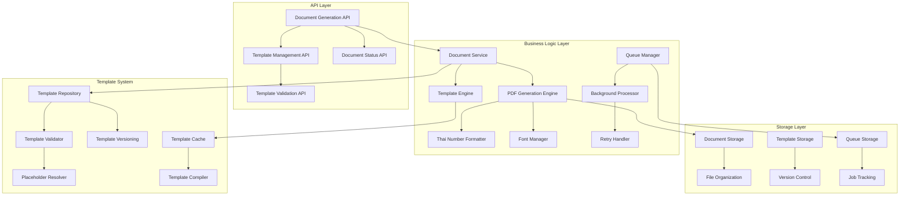
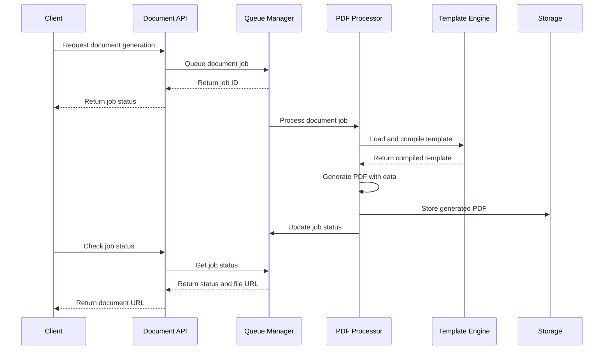

# Official Document Generation System Design

## Overview

การออกแบบระบบสร้างเอกสารทางราชการ PDF ที่มีประสิทธิภาพสูง รองรับการจัดรูปแบบเลขไทย/อารบิก, ระบบจัดการ template ที่ยืดหยุ่น, และ document processing pipeline ที่สามารถจัดการงานได้อย่างมีประสิทธิภาพ โดยใช้ Puppeteer สำหรับ PDF generation และ queue system สำหรับ background processing

## Architecture

### Document Generation System Architecture



### PDF Generation Pipeline Architecture



## Components and Interfaces

### 1. PDF Generation Engine

#### PDF Generator Interface
```typescript
interface PDFGenerator {
  generatePDF(request: PDFGenerationRequest): Promise<PDFGenerationResult>;
  generateBatch(requests: PDFGenerationRequest[]): Promise<PDFGenerationResult[]>;
  validateTemplate(template: DocumentTemplate): Promise<ValidationResult>;
  previewTemplate(template: DocumentTemplate, data: any): Promise<string>; // HTML preview
}

interface PDFGenerationRequest {
  template_id: string;
  data: Record<string, any>;
  options: PDFGenerationOptions;
  metadata: DocumentMetadata;
}

interface PDFGenerationOptions {
  language: 'th' | 'en';
  number_format: 'thai' | 'arabic';
  page_format: 'A4' | 'Letter';
  orientation: 'portrait' | 'landscape';
  margins: PageMargins;
  header_footer: boolean;
  watermark?: WatermarkOptions;
  quality: 'draft' | 'standard' | 'high';
}

interface PDFGenerationResult {
  success: boolean;
  document_id: string;
  file_url: string;
  file_path: string;
  file_size: number;
  generation_time: number;
  error?: string;
  metadata: DocumentMetadata;
}
```

#### Thai Number Formatter Interface
```typescript
interface ThaiNumberFormatter {
  formatNumber(input: string | number, type: 'thai' | 'arabic'): string;
  formatDate(date: Date, language: 'th' | 'en', format?: DateFormat): string;
  formatCurrency(amount: number, currency: 'THB' | 'USD', language: 'th' | 'en'): string;
  formatOrdinal(number: number, language: 'th' | 'en'): string;
}

interface DateFormat {
  day: 'numeric' | '2-digit';
  month: 'numeric' | '2-digit' | 'short' | 'long';
  year: 'numeric' | '2-digit';
  era?: 'buddhist' | 'gregorian';
}

interface ThaiDigitMap {
  '0': '๐';
  '1': '๑';
  '2': '๒';
  '3': '๓';
  '4': '๔';
  '5': '๕';
  '6': '๖';
  '7': '๗';
  '8': '๘';
  '9': '๙';
}
```

### 2. Template Management System

#### Template Model Interface
```typescript
interface DocumentTemplate extends BaseModel {
  id: string;
  name: string;
  display_name: string;
  description: string;
  category: TemplateCategory;
  version: string;
  html_content: string;
  css_content: string;
  placeholders: TemplatePlaceholder[];
  required_fields: string[];
  optional_fields: string[];
  default_options: PDFGenerationOptions;
  is_active: boolean;
  is_system: boolean;
  created_by: string;
  created_at: DateTime;
  updated_at: DateTime;
  
  // Relationships
  versions: HasMany<typeof TemplateVersion>;
  documents: HasMany<typeof GeneratedDocument>;
  
  // Methods
  validate(): Promise<ValidationResult>;
  compile(data: any): Promise<string>;
  getPlaceholders(): TemplatePlaceholder[];
  clone(newName: string): Promise<DocumentTemplate>;
}

interface TemplatePlaceholder {
  name: string;
  type: 'text' | 'number' | 'date' | 'currency' | 'boolean' | 'array' | 'object';
  required: boolean;
  default_value?: any;
  validation?: PlaceholderValidation;
  description: string;
  example?: any;
}

interface PlaceholderValidation {
  min_length?: number;
  max_length?: number;
  pattern?: string;
  min_value?: number;
  max_value?: number;
  allowed_values?: any[];
}

enum TemplateCategory {
  OFFICIAL_LETTER = 'official_letter',
  CERTIFICATE = 'certificate',
  REPORT = 'report',
  FORM = 'form',
  INVOICE = 'invoice',
  CONTRACT = 'contract',
  OTHER = 'other'
}
```

#### Template Service Interface
```typescript
interface TemplateService {
  createTemplate(data: CreateTemplateDTO): Promise<DocumentTemplate>;
  updateTemplate(id: string, data: UpdateTemplateDTO): Promise<DocumentTemplate>;
  deleteTemplate(id: string): Promise<void>;
  getTemplate(id: string): Promise<DocumentTemplate>;
  listTemplates(filters?: TemplateFilters): Promise<DocumentTemplate[]>;
  validateTemplate(template: DocumentTemplate): Promise<ValidationResult>;
  compileTemplate(templateId: string, data: any): Promise<string>;
  cloneTemplate(sourceId: string, newName: string): Promise<DocumentTemplate>;
  getTemplateHistory(id: string): Promise<TemplateVersion[]>;
  restoreTemplateVersion(id: string, version: string): Promise<DocumentTemplate>;
}

interface CreateTemplateDTO {
  name: string;
  display_name: string;
  description?: string;
  category: TemplateCategory;
  html_content: string;
  css_content?: string;
  default_options?: Partial<PDFGenerationOptions>;
  placeholders?: TemplatePlaceholder[];
}

interface TemplateFilters {
  category?: TemplateCategory;
  is_active?: boolean;
  created_by?: string;
  search?: string;
  tags?: string[];
}
```

### 3. Document Processing Pipeline

#### Queue Manager Interface
```typescript
interface QueueManager {
  queueDocument(request: DocumentQueueRequest): Promise<DocumentJob>;
  getJobStatus(jobId: string): Promise<JobStatus>;
  cancelJob(jobId: string): Promise<boolean>;
  retryJob(jobId: string): Promise<DocumentJob>;
  getQueueStats(): Promise<QueueStats>;
  processNextJob(): Promise<void>;
  cleanupCompletedJobs(olderThan: DateTime): Promise<number>;
}

interface DocumentQueueRequest {
  template_id: string;
  data: Record<string, any>;
  options: PDFGenerationOptions;
  priority: JobPriority;
  user_id: string;
  callback_url?: string;
  metadata?: Record<string, any>;
}

interface DocumentJob extends BaseModel {
  id: string;
  template_id: string;
  user_id: string;
  status: JobStatus;
  priority: JobPriority;
  data: Record<string, any>;
  options: PDFGenerationOptions;
  result?: PDFGenerationResult;
  error_message?: string;
  retry_count: number;
  max_retries: number;
  scheduled_at: DateTime;
  started_at?: DateTime;
  completed_at?: DateTime;
  callback_url?: string;
  metadata: Record<string, any>;
  created_at: DateTime;
  updated_at: DateTime;
}

enum JobStatus {
  QUEUED = 'queued',
  PROCESSING = 'processing',
  COMPLETED = 'completed',
  FAILED = 'failed',
  CANCELLED = 'cancelled',
  RETRYING = 'retrying'
}

enum JobPriority {
  LOW = 1,
  NORMAL = 5,
  HIGH = 8,
  URGENT = 10
}

interface QueueStats {
  total_jobs: number;
  queued_jobs: number;
  processing_jobs: number;
  completed_jobs: number;
  failed_jobs: number;
  average_processing_time: number;
  queue_health: 'healthy' | 'warning' | 'critical';
}
```

#### Background Processor Interface
```typescript
interface BackgroundProcessor {
  start(): Promise<void>;
  stop(): Promise<void>;
  processJob(job: DocumentJob): Promise<void>;
  handleJobFailure(job: DocumentJob, error: Error): Promise<void>;
  scheduleRetry(job: DocumentJob): Promise<void>;
  notifyJobCompletion(job: DocumentJob): Promise<void>;
}

interface RetryHandler {
  shouldRetry(job: DocumentJob, error: Error): boolean;
  calculateRetryDelay(retryCount: number): number;
  getMaxRetries(jobType: string): number;
  handleMaxRetriesExceeded(job: DocumentJob): Promise<void>;
}

interface RetryConfig {
  max_retries: number;
  initial_delay: number; // milliseconds
  max_delay: number; // milliseconds
  backoff_multiplier: number;
  jitter: boolean;
}
```

### 4. Document Storage and Organization

#### Document Storage Interface
```typescript
interface DocumentStorage {
  storeDocument(document: Buffer, metadata: DocumentMetadata): Promise<StoredDocument>;
  getDocument(documentId: string): Promise<StoredDocument>;
  deleteDocument(documentId: string): Promise<boolean>;
  listDocuments(filters: DocumentFilters): Promise<StoredDocument[]>;
  getDocumentUrl(documentId: string, expiresIn?: number): Promise<string>;
  organizeDocuments(): Promise<OrganizationResult>;
  cleanupExpiredDocuments(): Promise<number>;
}

interface StoredDocument {
  id: string;
  original_name: string;
  file_name: string;
  file_path: string;
  file_size: number;
  mime_type: string;
  checksum: string;
  storage_path: string;
  public_url?: string;
  expires_at?: DateTime;
  metadata: DocumentMetadata;
  created_at: DateTime;
}

interface DocumentMetadata {
  template_id: string;
  template_name: string;
  user_id: string;
  document_type: string;
  language: 'th' | 'en';
  generation_options: PDFGenerationOptions;
  data_hash: string;
  tags?: string[];
  custom_fields?: Record<string, any>;
}

interface DocumentFilters {
  user_id?: string;
  template_id?: string;
  document_type?: string;
  language?: 'th' | 'en';
  date_from?: DateTime;
  date_to?: DateTime;
  tags?: string[];
  search?: string;
}

interface OrganizationResult {
  organized_count: number;
  created_directories: string[];
  moved_files: number;
  errors: string[];
}
```

## Data Models

### Database Schema Models
```typescript
// Document templates table
interface DocumentTemplatesTable {
  id: string; // VARCHAR(36) PRIMARY KEY (UUID)
  name: string; // VARCHAR(255) UNIQUE NOT NULL
  display_name: string; // VARCHAR(255) NOT NULL
  description: string; // TEXT NULL
  category: string; // VARCHAR(100) NOT NULL
  version: string; // VARCHAR(20) NOT NULL
  html_content: string; // LONGTEXT NOT NULL
  css_content: string; // LONGTEXT NULL
  placeholders: string; // JSON NULL
  required_fields: string; // JSON NULL
  optional_fields: string; // JSON NULL
  default_options: string; // JSON NULL
  is_active: boolean; // BOOLEAN DEFAULT TRUE
  is_system: boolean; // BOOLEAN DEFAULT FALSE
  created_by: string; // VARCHAR(20) NOT NULL
  created_at: Date; // TIMESTAMP DEFAULT CURRENT_TIMESTAMP
  updated_at: Date; // TIMESTAMP DEFAULT CURRENT_TIMESTAMP ON UPDATE CURRENT_TIMESTAMP
}

// Document jobs table
interface DocumentJobsTable {
  id: string; // VARCHAR(36) PRIMARY KEY (UUID)
  template_id: string; // VARCHAR(36) NOT NULL
  user_id: string; // VARCHAR(20) NOT NULL
  status: string; // ENUM('queued', 'processing', 'completed', 'failed', 'cancelled', 'retrying')
  priority: number; // INT DEFAULT 5
  data: string; // JSON NOT NULL
  options: string; // JSON NOT NULL
  result: string; // JSON NULL
  error_message: string; // TEXT NULL
  retry_count: number; // INT DEFAULT 0
  max_retries: number; // INT DEFAULT 3
  scheduled_at: Date; // TIMESTAMP NOT NULL
  started_at: Date; // TIMESTAMP NULL
  completed_at: Date; // TIMESTAMP NULL
  callback_url: string; // VARCHAR(500) NULL
  metadata: string; // JSON NULL
  created_at: Date; // TIMESTAMP DEFAULT CURRENT_TIMESTAMP
  updated_at: Date; // TIMESTAMP DEFAULT CURRENT_TIMESTAMP ON UPDATE CURRENT_TIMESTAMP
}

// Generated documents table
interface GeneratedDocumentsTable {
  id: string; // VARCHAR(36) PRIMARY KEY (UUID)
  job_id: string; // VARCHAR(36) NOT NULL
  template_id: string; // VARCHAR(36) NOT NULL
  user_id: string; // VARCHAR(20) NOT NULL
  original_name: string; // VARCHAR(255) NOT NULL
  file_name: string; // VARCHAR(255) NOT NULL
  file_path: string; // VARCHAR(500) NOT NULL
  file_size: number; // BIGINT NOT NULL
  mime_type: string; // VARCHAR(100) NOT NULL
  checksum: string; // VARCHAR(64) NOT NULL
  storage_path: string; // VARCHAR(500) NOT NULL
  public_url: string; // VARCHAR(500) NULL
  expires_at: Date; // TIMESTAMP NULL
  metadata: string; // JSON NULL
  created_at: Date; // TIMESTAMP DEFAULT CURRENT_TIMESTAMP
  updated_at: Date; // TIMESTAMP DEFAULT CURRENT_TIMESTAMP ON UPDATE CURRENT_TIMESTAMP
}

// Template versions table
interface TemplateVersionsTable {
  id: string; // VARCHAR(36) PRIMARY KEY (UUID)
  template_id: string; // VARCHAR(36) NOT NULL
  version: string; // VARCHAR(20) NOT NULL
  html_content: string; // LONGTEXT NOT NULL
  css_content: string; // LONGTEXT NULL
  placeholders: string; // JSON NULL
  change_log: string; // TEXT NULL
  created_by: string; // VARCHAR(20) NOT NULL
  created_at: Date; // TIMESTAMP DEFAULT CURRENT_TIMESTAMP
}
```

### Configuration Models
```typescript
interface PDFGenerationConfig {
  puppeteer: {
    headless: boolean;
    args: string[];
    timeout: number;
    viewport: {
      width: number;
      height: number;
    };
  };
  
  pdf_options: {
    format: 'A4' | 'Letter';
    margin: {
      top: string;
      right: string;
      bottom: string;
      left: string;
    };
    printBackground: boolean;
    preferCSSPageSize: boolean;
  };
  
  fonts: {
    thai_fonts: string[];
    english_fonts: string[];
    fallback_fonts: string[];
  };
  
  performance: {
    max_concurrent_jobs: number;
    job_timeout: number;
    memory_limit: string;
    cleanup_interval: number;
  };
}

interface StorageConfig {
  storage_path: string;
  max_file_size: number;
  allowed_mime_types: string[];
  retention_days: number;
  organization: {
    by_date: boolean;
    by_user: boolean;
    by_template: boolean;
    directory_structure: string;
  };
}
```

## Error Handling

### Document Generation Errors
```typescript
enum DocumentGenerationError {
  TEMPLATE_NOT_FOUND = 'TEMPLATE_NOT_FOUND',
  TEMPLATE_INVALID = 'TEMPLATE_INVALID',
  TEMPLATE_COMPILATION_FAILED = 'TEMPLATE_COMPILATION_FAILED',
  MISSING_REQUIRED_DATA = 'MISSING_REQUIRED_DATA',
  INVALID_DATA_FORMAT = 'INVALID_DATA_FORMAT',
  PDF_GENERATION_FAILED = 'PDF_GENERATION_FAILED',
  STORAGE_ERROR = 'STORAGE_ERROR',
  QUEUE_FULL = 'QUEUE_FULL',
  JOB_TIMEOUT = 'JOB_TIMEOUT',
  FONT_LOADING_FAILED = 'FONT_LOADING_FAILED',
  MEMORY_LIMIT_EXCEEDED = 'MEMORY_LIMIT_EXCEEDED',
  CONCURRENT_LIMIT_EXCEEDED = 'CONCURRENT_LIMIT_EXCEEDED',
}

interface DocumentErrorHandler {
  handleError(error: DocumentGenerationError, context: any): Response;
  logGenerationEvent(event: GenerationEvent, context: any): Promise<void>;
  notifyAdmins(error: DocumentGenerationError, context: any): Promise<void>;
  suggestResolution(error: DocumentGenerationError, context: any): string[];
}

interface GenerationEvent {
  type: 'generation_started' | 'generation_completed' | 'generation_failed' | 'template_updated' | 'queue_overflow';
  job_id: string;
  template_id: string;
  user_id: string;
  details: Record<string, any>;
  timestamp: DateTime;
  processing_time?: number;
}
```

### Error Messages
```typescript
interface DocumentErrorMessages {
  template_errors: {
    template_not_found: "ไม่พบเทมเพลตที่ระบุ";
    template_invalid: "เทมเพลตไม่ถูกต้องหรือเสียหาย";
    compilation_failed: "ไม่สามารถประมวลผลเทมเพลตได้";
    missing_placeholders: "เทมเพลตขาดข้อมูลที่จำเป็น";
  };
  
  data_errors: {
    missing_required_data: "ขาดข้อมูลที่จำเป็นสำหรับการสร้างเอกสาร";
    invalid_data_format: "รูปแบบข้อมูลไม่ถูกต้อง";
    data_validation_failed: "ข้อมูลไม่ผ่านการตรวจสอบ";
  };
  
  generation_errors: {
    pdf_generation_failed: "ไม่สามารถสร้างไฟล์ PDF ได้";
    font_loading_failed: "ไม่สามารถโหลดฟอนต์ได้";
    memory_limit_exceeded: "ใช้หน่วยความจำเกินขีดจำกัด";
    timeout: "การสร้างเอกสารใช้เวลานานเกินไป";
  };
  
  queue_errors: {
    queue_full: "คิวการสร้างเอกสารเต็ม กรุณาลองใหม่ภายหลัง";
    job_not_found: "ไม่พบงานที่ระบุ";
    job_cancelled: "งานถูกยกเลิกแล้ว";
    max_retries_exceeded: "ลองสร้างเอกสารซ้ำเกินขีดจำกัดแล้ว";
  };
}
```

## Performance and Optimization

### Performance Configuration
```typescript
interface PerformanceConfig {
  pdf_generation: {
    max_concurrent_jobs: 5;
    job_timeout_ms: 300000; // 5 minutes
    memory_limit_mb: 1024;
    puppeteer_pool_size: 3;
    reuse_browser_instances: boolean;
  };
  
  template_caching: {
    enable_cache: boolean;
    cache_ttl: 3600; // 1 hour
    max_cache_size: 1000;
    precompile_templates: boolean;
  };
  
  queue_processing: {
    batch_size: 10;
    processing_interval: 1000; // 1 second
    priority_processing: boolean;
    dead_letter_queue: boolean;
  };
  
  storage_optimization: {
    compress_pdfs: boolean;
    compression_quality: 0.8;
    enable_cdn: boolean;
    cleanup_interval: 86400; // 24 hours
  };
}
```

### Caching Strategy
```typescript
interface CachingStrategy {
  template_cache: {
    provider: 'memory' | 'redis';
    ttl: 3600; // 1 hour
    max_size: 1000;
    compression: boolean;
  };
  
  compiled_template_cache: {
    provider: 'redis';
    ttl: 7200; // 2 hours
    max_size: 500;
    invalidate_on_update: boolean;
  };
  
  font_cache: {
    provider: 'memory';
    preload_fonts: string[];
    cache_duration: 86400; // 24 hours
  };
  
  document_cache: {
    provider: 'filesystem';
    ttl: 604800; // 7 days
    max_size_gb: 10;
    cleanup_strategy: 'lru' | 'fifo';
  };
}
```

## Security Considerations

### Document Security
```typescript
interface DocumentSecurityConfig {
  access_control: {
    require_authentication: boolean;
    user_isolation: boolean; // Users can only access their own documents
    admin_override: boolean;
    audit_access: boolean;
  };
  
  template_security: {
    validate_html: boolean;
    sanitize_input: boolean;
    restrict_external_resources: boolean;
    allowed_tags: string[];
    blocked_scripts: boolean;
  };
  
  file_security: {
    virus_scanning: boolean;
    file_type_validation: boolean;
    size_limits: {
      max_template_size: number;
      max_pdf_size: number;
    };
    encryption_at_rest: boolean;
  };
  
  data_protection: {
    sanitize_user_data: boolean;
    log_data_access: boolean;
    data_retention_days: number;
    gdpr_compliance: boolean;
  };
}
```

## API Endpoints Design

### Document Generation Endpoints
```typescript
interface DocumentGenerationEndpoints {
  'POST /api/documents/generate': {
    body: {
      template_id: string;
      data: Record<string, any>;
      options?: Partial<PDFGenerationOptions>;
      priority?: JobPriority;
    };
    response: {
      job_id: string;
      status: JobStatus;
      estimated_completion: DateTime;
    };
  };
  
  'GET /api/documents/jobs/:job_id': {
    params: { job_id: string };
    response: {
      job_id: string;
      status: JobStatus;
      progress?: number;
      result?: PDFGenerationResult;
      error?: string;
    };
  };
  
  'POST /api/documents/generate/sync': {
    body: {
      template_id: string;
      data: Record<string, any>;
      options?: Partial<PDFGenerationOptions>;
    };
    response: PDFGenerationResult;
  };
  
  'GET /api/documents/:document_id': {
    params: { document_id: string };
    response: StoredDocument;
  };
  
  'GET /api/documents/:document_id/download': {
    params: { document_id: string };
    response: Buffer; // PDF file
  };
  
  'DELETE /api/documents/:document_id': {
    params: { document_id: string };
    response: { success: boolean };
  };
}
```

### Template Management Endpoints
```typescript
interface TemplateManagementEndpoints {
  'GET /api/templates': {
    query?: TemplateFilters;
    response: DocumentTemplate[];
  };
  
  'POST /api/templates': {
    body: CreateTemplateDTO;
    response: DocumentTemplate;
  };
  
  'GET /api/templates/:id': {
    params: { id: string };
    response: DocumentTemplate;
  };
  
  'PUT /api/templates/:id': {
    params: { id: string };
    body: UpdateTemplateDTO;
    response: DocumentTemplate;
  };
  
  'DELETE /api/templates/:id': {
    params: { id: string };
    response: { success: boolean };
  };
  
  'POST /api/templates/:id/validate': {
    params: { id: string };
    response: ValidationResult;
  };
  
  'POST /api/templates/:id/preview': {
    params: { id: string };
    body: { data: Record<string, any> };
    response: { html: string };
  };
  
  'POST /api/templates/:id/clone': {
    params: { id: string };
    body: { name: string };
    response: DocumentTemplate;
  };
}
```

## Implementation Approach

### Phase 1: Core PDF Generation Engine
1. Set up Puppeteer-based PDF generation with Thai font support
2. Implement Thai number formatting and date conversion utilities
3. Create basic template compilation and rendering system
4. Build document storage and file organization system

### Phase 2: Template Management System
1. Create template CRUD operations with validation
2. Implement template versioning and history tracking
3. Build placeholder system and data validation
4. Add template caching and compilation optimization

### Phase 3: Queue and Background Processing
1. Implement job queue system with priority support
2. Create background processor with retry mechanisms
3. Add job status tracking and progress monitoring
4. Build notification system for job completion

### Phase 4: Advanced Features
1. Add batch document generation capabilities
2. Implement template cloning and inheritance
3. Create document analytics and usage tracking
4. Build admin dashboard for system monitoring

### Phase 5: Performance and Security
1. Implement comprehensive caching strategies
2. Add security measures and access controls
3. Create performance monitoring and optimization
4. Build comprehensive error handling and logging

### Phase 6: Testing and Documentation
1. Create comprehensive test suite for all components
2. Add performance and load testing
3. Build API documentation and user guides
4. Implement monitoring and alerting systems