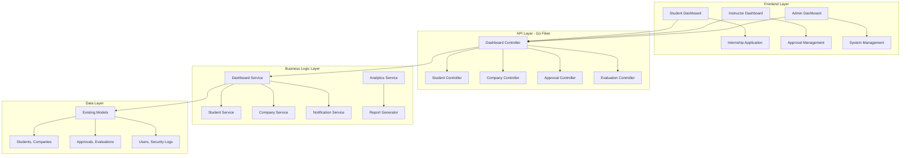

# Student Internship Management System - Design

## Overview

การออกแบบระบบจัดการการฝึkงานแบบครบวงจร โดยใช้ Go Fiber backend ที่มีอยู่ เพิ่มเติม features ตาม flow สีฟ้าเขียว เพื่อให้เสร็จทันบ่ายเย็นนี้

## Architecture

### System Architecture Overview



### Enhanced API Endpoints

```mermaid
graph LR
    subgraph "Dashboard APIs"
        A[/api/v1/dashboard/student/:id]
        B[/api/v1/dashboard/instructor/:id]
        C[/api/v1/dashboard/admin]
    end
    
    subgraph "Management APIs"
        D[/api/v1/students/*]
        E[/api/v1/companies/*]
        F[/api/v1/approvals/*]
        G[/api/v1/evaluations/*]
    end
    
    subgraph "Analytics APIs"
        H[/api/v1/analytics/stats]
        I[/api/v1/analytics/reports]
        J[/api/v1/notifications/*]
    end
```

## Components and Interfaces

### 1. Enhanced Dashboard Service

```go
// Dashboard data structures (already implemented)
type StudentDashboardData struct {
    StudentInfo       *models.Student                    `json:"student_info"`
    CurrentEnrollment *models.StudentEnroll              `json:"current_enrollment"`
    InternshipStatus  *models.InternshipApproval         `json:"internship_status"`
    TrainingInfo      *models.StudentTraining            `json:"training_info"`
    EvaluationStatus  []models.EvaluationStatusTracker   `json:"evaluation_status"`
    RecentActivities  []DashboardActivity                `json:"recent_activities"`
    Notifications     []DashboardNotification            `json:"notifications"`
}

type InstructorDashboardData struct {
    InstructorInfo      *models.Instructor              `json:"instructor_info"`
    PendingApprovals    []models.InternshipApproval     `json:"pending_approvals"`
    AssignedEvaluations []models.EvaluationStatusTracker `json:"assigned_evaluations"`
    StudentCount        int64                           `json:"student_count"`
    RecentActivities    []DashboardActivity             `json:"recent_activities"`
    Statistics          InstructorStats                 `json:"statistics"`
}

type AdminDashboardData struct {
    OverallStats     AdminOverallStats   `json:"overall_stats"`
    RecentActivities []DashboardActivity `json:"recent_activities"`
    SystemHealth     SystemHealthStatus  `json:"system_health"`
    Charts           AdminChartData      `json:"charts"`
}
```

### 2. Analytics Service (New)

```go
package services

type AnalyticsService struct {
    db *gorm.DB
}

type AnalyticsRequest struct {
    StartDate   time.Time `json:"start_date"`
    EndDate     time.Time `json:"end_date"`
    GroupBy     string    `json:"group_by"` // month, week, day
    FilterBy    string    `json:"filter_by"`
    FilterValue string    `json:"filter_value"`
}

type AnalyticsResponse struct {
    TotalInternships    int64                 `json:"total_internships"`
    ApprovalRate        float64               `json:"approval_rate"`
    CompletionRate      float64               `json:"completion_rate"`
    TopCompanies        []CompanyStats        `json:"top_companies"`
    MonthlyTrends       []MonthlyTrendData    `json:"monthly_trends"`
    FacultyDistribution []FacultyStatsData    `json:"faculty_distribution"`
}

func (s *AnalyticsService) GetInternshipAnalytics(req AnalyticsRequest) (*AnalyticsResponse, error) {
    // Implementation for comprehensive analytics
    return &AnalyticsResponse{}, nil
}

func (s *AnalyticsService) GenerateReport(reportType string, params map[string]interface{}) ([]byte, error) {
    // Generate PDF/Excel reports
    return []byte{}, nil
}
```

### 3. Enhanced Notification Service

```go
package services

type NotificationService struct {
    db *gorm.DB
}

type NotificationRequest struct {
    UserID      uint                   `json:"user_id"`
    Type        string                 `json:"type"`
    Title       string                 `json:"title"`
    Message     string                 `json:"message"`
    Priority    string                 `json:"priority"`
    ActionURL   string                 `json:"action_url"`
    Metadata    map[string]interface{} `json:"metadata"`
}

type NotificationResponse struct {
    ID          uint      `json:"id"`
    Type        string    `json:"type"`
    Title       string    `json:"title"`
    Message     string    `json:"message"`
    IsRead      bool      `json:"is_read"`
    Priority    string    `json:"priority"`
    ActionURL   string    `json:"action_url"`
    CreatedAt   time.Time `json:"created_at"`
}

func (s *NotificationService) SendNotification(req NotificationRequest) error {
    // Send real-time notification
    return nil
}

func (s *NotificationService) GetUserNotifications(userID uint, limit int) ([]NotificationResponse, error) {
    // Get user notifications with pagination
    return []NotificationResponse{}, nil
}

func (s *NotificationService) MarkAsRead(notificationID uint) error {
    // Mark notification as read
    return nil
}
```

## Data Models Enhancement

### 1. Notification Model (New)

```go
package models

type Notification struct {
    ID        uint                   `gorm:"primaryKey;autoIncrement" json:"id"`
    UserID    uint                   `gorm:"not null;index" json:"user_id"`
    Type      string                 `gorm:"not null" json:"type"`
    Title     string                 `gorm:"not null" json:"title"`
    Message   string                 `gorm:"type:text" json:"message"`
    IsRead    bool                   `gorm:"default:false" json:"is_read"`
    Priority  string                 `gorm:"default:normal" json:"priority"`
    ActionURL string                 `json:"action_url"`
    Metadata  json.RawMessage        `gorm:"type:json" json:"metadata"`
    ReadAt    *time.Time             `json:"read_at"`
    CreatedAt time.Time              `gorm:"autoCreateTime" json:"created_at"`
    UpdatedAt time.Time              `gorm:"autoUpdateTime" json:"updated_at"`
}

func (Notification) TableName() string {
    return "notifications"
}
```

### 2. Activity Log Model (New)

```go
package models

type ActivityLog struct {
    ID          uint                   `gorm:"primaryKey;autoIncrement" json:"id"`
    UserID      uint                   `gorm:"not null;index" json:"user_id"`
    Action      string                 `gorm:"not null" json:"action"`
    EntityType  string                 `gorm:"not null" json:"entity_type"`
    EntityID    uint                   `json:"entity_id"`
    Description string                 `gorm:"type:text" json:"description"`
    IPAddress   string                 `json:"ip_address"`
    UserAgent   string                 `json:"user_agent"`
    Metadata    json.RawMessage        `gorm:"type:json" json:"metadata"`
    CreatedAt   time.Time              `gorm:"autoCreateTime" json:"created_at"`
}

func (ActivityLog) TableName() string {
    return "activity_logs"
}
```

## API Controllers Enhancement

### 1. Analytics Controller (New)

```go
package handlers

type AnalyticsHandler struct {
    analyticsService *services.AnalyticsService
}

func (h *AnalyticsHandler) GetInternshipAnalytics(c *fiber.Ctx) error {
    var req services.AnalyticsRequest
    if err := c.BodyParser(&req); err != nil {
        return c.Status(400).JSON(fiber.Map{"error": "Invalid request"})
    }
    
    analytics, err := h.analyticsService.GetInternshipAnalytics(req)
    if err != nil {
        return c.Status(500).JSON(fiber.Map{"error": "Failed to get analytics"})
    }
    
    return c.JSON(analytics)
}

func (h *AnalyticsHandler) GenerateReport(c *fiber.Ctx) error {
    reportType := c.Params("type")
    
    report, err := h.analyticsService.GenerateReport(reportType, nil)
    if err != nil {
        return c.Status(500).JSON(fiber.Map{"error": "Failed to generate report"})
    }
    
    c.Set("Content-Type", "application/pdf")
    return c.Send(report)
}
```

### 2. Enhanced Notification Controller

```go
package handlers

type NotificationHandler struct {
    notificationService *services.NotificationService
}

func (h *NotificationHandler) GetNotifications(c *fiber.Ctx) error {
    userID := c.Locals("user_id").(uint)
    limit, _ := strconv.Atoi(c.Query("limit", "20"))
    
    notifications, err := h.notificationService.GetUserNotifications(userID, limit)
    if err != nil {
        return c.Status(500).JSON(fiber.Map{"error": "Failed to get notifications"})
    }
    
    return c.JSON(notifications)
}

func (h *NotificationHandler) MarkAsRead(c *fiber.Ctx) error {
    id, _ := strconv.ParseUint(c.Params("id"), 10, 32)
    
    err := h.notificationService.MarkAsRead(uint(id))
    if err != nil {
        return c.Status(500).JSON(fiber.Map{"error": "Failed to mark as read"})
    }
    
    return c.JSON(fiber.Map{"success": true})
}
```

## Performance Optimization

### 1. Database Indexing Strategy

```sql
-- Indexes for better performance
CREATE INDEX idx_students_student_id ON students(student_id);
CREATE INDEX idx_internship_approvals_status ON internship_approvals(status);
CREATE INDEX idx_evaluation_trackers_status ON evaluation_status_trackers(status);
CREATE INDEX idx_notifications_user_read ON notifications(user_id, is_read);
CREATE INDEX idx_activity_logs_user_date ON activity_logs(user_id, created_at);
```

### 2. Caching Strategy

```go
package cache

type CacheService struct {
    redis *redis.Client
}

func (c *CacheService) CacheDashboardData(userID uint, data interface{}) error {
    key := fmt.Sprintf("dashboard:%d", userID)
    return c.redis.Set(context.Background(), key, data, 5*time.Minute).Err()
}

func (c *CacheService) GetDashboardData(userID uint) (interface{}, error) {
    key := fmt.Sprintf("dashboard:%d", userID)
    return c.redis.Get(context.Background(), key).Result()
}
```

## Security Enhancements

### 1. Rate Limiting

```go
package middleware

func DashboardRateLimit() fiber.Handler {
    return limiter.New(limiter.Config{
        Max:        30,               // 30 requests
        Expiration: 1 * time.Minute,  // per minute
        KeyGenerator: func(c *fiber.Ctx) string {
            return c.IP() + ":" + c.Locals("user_id").(string)
        },
    })
}
```

### 2. Input Validation

```go
package validation

type DashboardValidator struct {
    validator *validator.Validate
}

func (v *DashboardValidator) ValidateAnalyticsRequest(req services.AnalyticsRequest) error {
    if req.StartDate.After(req.EndDate) {
        return errors.New("start date must be before end date")
    }
    
    if req.EndDate.After(time.Now()) {
        return errors.New("end date cannot be in the future")
    }
    
    return v.validator.Struct(req)
}
```

## Testing Strategy

### 1. Unit Tests

```go
package services_test

func TestDashboardService_GetStudentDashboard(t *testing.T) {
    // Test student dashboard data retrieval
    service := setupDashboardService()
    
    dashboard, err := service.GetStudentDashboard(1)
    
    assert.NoError(t, err)
    assert.NotNil(t, dashboard.StudentInfo)
    assert.NotNil(t, dashboard.RecentActivities)
}

func TestAnalyticsService_GetInternshipAnalytics(t *testing.T) {
    // Test analytics calculation
    service := setupAnalyticsService()
    
    req := services.AnalyticsRequest{
        StartDate: time.Now().AddDate(0, -1, 0),
        EndDate:   time.Now(),
        GroupBy:   "month",
    }
    
    analytics, err := service.GetInternshipAnalytics(req)
    
    assert.NoError(t, err)
    assert.NotNil(t, analytics)
}
```

### 2. Integration Tests

```go
package handlers_test

func TestDashboardHandler_GetStudentDashboard(t *testing.T) {
    app := setupTestApp()
    
    req := httptest.NewRequest("GET", "/api/v1/dashboard/student/1", nil)
    req.Header.Set("Authorization", "Bearer "+validToken)
    
    resp, err := app.Test(req)
    
    assert.NoError(t, err)
    assert.Equal(t, 200, resp.StatusCode)
}
```

## Implementation Priority

### Phase 1: Core Dashboard (2 hours)
1. Complete dashboard services implementation
2. Add missing analytics functions
3. Test dashboard endpoints

### Phase 2: Notifications (1 hour)
1. Implement notification service
2. Add real-time notification endpoints
3. Test notification flow

### Phase 3: Analytics & Reports (1 hour)
1. Implement analytics service
2. Add report generation
3. Test analytics endpoints

### Phase 4: Integration & Testing (1 hour)
1. Integration testing
2. Performance optimization
3. Final deployment preparation

**Total Time: 5 hours (เสร็จทันบ่ายเย็น)**