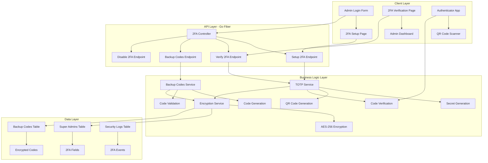
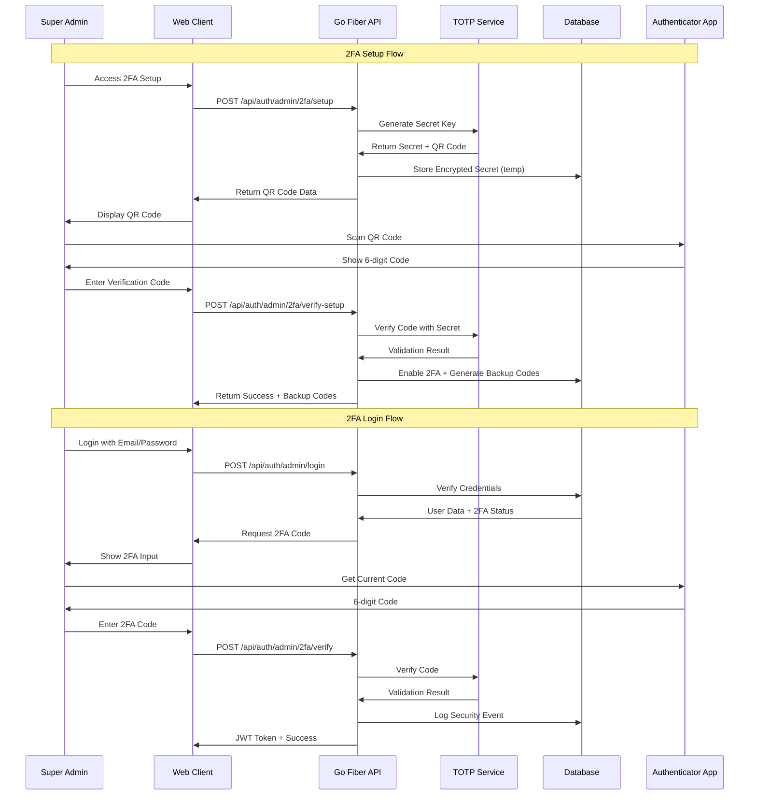

# Super Admin 2FA Enhancement Design

## Overview

การออกแบบระบบ Two-Factor Authentication (2FA) สำหรับ Super Admin โดยใช้ TOTP (Time-based One-Time Password) algorithm ตาม RFC 6238 ร่วมกับ Go Fiber backend ที่มีอยู่ เพื่อเพิ่มความปลอดภัยในการเข้าถึงระบบจัดการ

## Architecture

### 2FA System Architecture



### 2FA Flow Diagram



## Components and Interfaces

### 1. TOTP Service (Go)

```go
package services

import (
    "crypto/rand"
    "encoding/base32"
    "fmt"
    "time"
    "github.com/pquerna/otp"
    "github.com/pquerna/otp/totp"
)

type TOTPService struct {
    issuer      string
    accountName string
}

type TOTPConfig struct {
    Secret      string    `json:"secret"`
    QRCode      string    `json:"qr_code"`
    BackupCodes []string  `json:"backup_codes"`
    URL         string    `json:"url"`
}

type TOTPVerification struct {
    IsValid     bool      `json:"is_valid"`
    Code        string    `json:"code"`
    Window      int       `json:"window"`
    Timestamp   time.Time `json:"timestamp"`
}

func NewTOTPService(issuer string) *TOTPService {
    return &TOTPService{
        issuer: issuer,
    }
}

func (s *TOTPService) GenerateSecret(accountName string) (*TOTPConfig, error) {
    // Generate 32-byte random secret
    secret := make([]byte, 32)
    _, err := rand.Read(secret)
    if err != nil {
        return nil, fmt.Errorf("failed to generate secret: %w", err)
    }
    
    secretBase32 := base32.StdEncoding.EncodeToString(secret)
    
    // Generate TOTP key
    key, err := totp.Generate(totp.GenerateOpts{
        Issuer:      s.issuer,
        AccountName: accountName,
        Secret:      secret,
        SecretSize:  32,
        Digits:      otp.DigitsSix,
        Algorithm:   otp.AlgorithmSHA1,
        Period:      30,
    })
    if err != nil {
        return nil, fmt.Errorf("failed to generate TOTP key: %w", err)
    }
    
    // Generate QR code
    qrCode, err := s.generateQRCode(key.URL())
    if err != nil {
        return nil, fmt.Errorf("failed to generate QR code: %w", err)
    }
    
    return &TOTPConfig{
        Secret: secretBase32,
        QRCode: qrCode,
        URL:    key.URL(),
    }, nil
}

func (s *TOTPService) VerifyCode(secret, code string) (*TOTPVerification, error) {
    // Verify with 1 period window (30 seconds before/after)
    valid := totp.Validate(code, secret)
    
    return &TOTPVerification{
        IsValid:   valid,
        Code:      code,
        Window:    1,
        Timestamp: time.Now(),
    }, nil
}

func (s *TOTPService) generateQRCode(url string) (string, error) {
    // Implementation for QR code generation
    // Using go-qrcode library or similar
    return "", nil
}
```

### 2. Backup Codes Service (Go)

```go
package services

import (
    "crypto/rand"
    "encoding/hex"
    "fmt"
    "golang.org/x/crypto/bcrypt"
)

type BackupCodesService struct {
    codeLength int
    codeCount  int
}

type BackupCode struct {
    ID       uint      `json:"id" gorm:"primaryKey"`
    AdminID  uint      `json:"admin_id" gorm:"not null"`
    Code     string    `json:"code" gorm:"not null"`
    Used     bool      `json:"used" gorm:"default:false"`
    UsedAt   *time.Time `json:"used_at"`
    CreatedAt time.Time `json:"created_at"`
}

func NewBackupCodesService() *BackupCodesService {
    return &BackupCodesService{
        codeLength: 8,
        codeCount:  10,
    }
}

func (s *BackupCodesService) GenerateCodes(adminID uint) ([]string, error) {
    codes := make([]string, s.codeCount)
    
    for i := 0; i < s.codeCount; i++ {
        code, err := s.generateSingleCode()
        if err != nil {
            return nil, fmt.Errorf("failed to generate backup code: %w", err)
        }
        codes[i] = code
    }
    
    return codes, nil
}

func (s *BackupCodesService) generateSingleCode() (string, error) {
    bytes := make([]byte, s.codeLength/2)
    _, err := rand.Read(bytes)
    if err != nil {
        return "", err
    }
    
    return hex.EncodeToString(bytes), nil
}

func (s *BackupCodesService) HashCode(code string) (string, error) {
    hashedBytes, err := bcrypt.GenerateFromPassword([]byte(code), bcrypt.DefaultCost)
    if err != nil {
        return "", fmt.Errorf("failed to hash backup code: %w", err)
    }
    
    return string(hashedBytes), nil
}

func (s *BackupCodesService) VerifyCode(code, hashedCode string) bool {
    err := bcrypt.CompareHashAndPassword([]byte(hashedCode), []byte(code))
    return err == nil
}
```

### 3. Encryption Service (Go)

```go
package services

import (
    "crypto/aes"
    "crypto/cipher"
    "crypto/rand"
    "encoding/base64"
    "fmt"
    "io"
)

type EncryptionService struct {
    key []byte
}

func NewEncryptionService(key string) *EncryptionService {
    return &EncryptionService{
        key: []byte(key), // Should be 32 bytes for AES-256
    }
}

func (s *EncryptionService) Encrypt(plaintext string) (string, error) {
    block, err := aes.NewCipher(s.key)
    if err != nil {
        return "", fmt.Errorf("failed to create cipher: %w", err)
    }
    
    // Create GCM mode
    gcm, err := cipher.NewGCM(block)
    if err != nil {
        return "", fmt.Errorf("failed to create GCM: %w", err)
    }
    
    // Generate nonce
    nonce := make([]byte, gcm.NonceSize())
    if _, err := io.ReadFull(rand.Reader, nonce); err != nil {
        return "", fmt.Errorf("failed to generate nonce: %w", err)
    }
    
    // Encrypt
    ciphertext := gcm.Seal(nonce, nonce, []byte(plaintext), nil)
    
    return base64.StdEncoding.EncodeToString(ciphertext), nil
}

func (s *EncryptionService) Decrypt(ciphertext string) (string, error) {
    data, err := base64.StdEncoding.DecodeString(ciphertext)
    if err != nil {
        return "", fmt.Errorf("failed to decode base64: %w", err)
    }
    
    block, err := aes.NewCipher(s.key)
    if err != nil {
        return "", fmt.Errorf("failed to create cipher: %w", err)
    }
    
    gcm, err := cipher.NewGCM(block)
    if err != nil {
        return "", fmt.Errorf("failed to create GCM: %w", err)
    }
    
    nonceSize := gcm.NonceSize()
    if len(data) < nonceSize {
        return "", fmt.Errorf("ciphertext too short")
    }
    
    nonce, ciphertext := data[:nonceSize], data[nonceSize:]
    plaintext, err := gcm.Open(nil, nonce, ciphertext, nil)
    if err != nil {
        return "", fmt.Errorf("failed to decrypt: %w", err)
    }
    
    return string(plaintext), nil
}
```

### 4. 2FA Controller (Go Fiber)

```go
package controllers

import (
    "strconv"
    "time"
    
    "github.com/gofiber/fiber/v2"
    "your-project/models"
    "your-project/services"
)

type TwoFactorController struct {
    totpService        *services.TOTPService
    backupCodesService *services.BackupCodesService
    encryptionService  *services.EncryptionService
    db                 *gorm.DB
}

type Setup2FARequest struct {
    Password string `json:"password" validate:"required"`
}

type Verify2FASetupRequest struct {
    Code string `json:"code" validate:"required,len=6"`
}

type Verify2FARequest struct {
    Code     string `json:"code" validate:"required"`
    IsBackup bool   `json:"is_backup"`
}

type Setup2FAResponse struct {
    Success     bool     `json:"success"`
    QRCode      string   `json:"qr_code"`
    Secret      string   `json:"secret"`
    BackupCodes []string `json:"backup_codes,omitempty"`
}

func NewTwoFactorController(
    totpService *services.TOTPService,
    backupCodesService *services.BackupCodesService,
    encryptionService *services.EncryptionService,
    db *gorm.DB,
) *TwoFactorController {
    return &TwoFactorController{
        totpService:        totpService,
        backupCodesService: backupCodesService,
        encryptionService:  encryptionService,
        db:                 db,
    }
}

func (c *TwoFactorController) Setup2FA(ctx *fiber.Ctx) error {
    var req Setup2FARequest
    if err := ctx.BodyParser(&req); err != nil {
        return ctx.Status(400).JSON(fiber.Map{
            "success": false,
            "message": "Invalid request format",
        })
    }
    
    // Get admin from JWT token
    adminID := ctx.Locals("admin_id").(uint)
    
    var admin models.SuperAdmin
    if err := c.db.First(&admin, adminID).Error; err != nil {
        return ctx.Status(404).JSON(fiber.Map{
            "success": false,
            "message": "Admin not found",
        })
    }
    
    // Verify current password
    if !admin.VerifyPassword(req.Password) {
        return ctx.Status(401).JSON(fiber.Map{
            "success": false,
            "message": "Invalid password",
        })
    }
    
    // Generate TOTP secret
    totpConfig, err := c.totpService.GenerateSecret(admin.Email)
    if err != nil {
        return ctx.Status(500).JSON(fiber.Map{
            "success": false,
            "message": "Failed to generate 2FA secret",
        })
    }
    
    // Store temporary secret (encrypted)
    encryptedSecret, err := c.encryptionService.Encrypt(totpConfig.Secret)
    if err != nil {
        return ctx.Status(500).JSON(fiber.Map{
            "success": false,
            "message": "Failed to encrypt secret",
        })
    }
    
    // Update admin with temporary secret
    admin.TwoFactorSecret = &encryptedSecret
    admin.TwoFactorEnabled = false // Not enabled until verified
    
    if err := c.db.Save(&admin).Error; err != nil {
        return ctx.Status(500).JSON(fiber.Map{
            "success": false,
            "message": "Failed to save 2FA setup",
        })
    }
    
    return ctx.JSON(Setup2FAResponse{
        Success: true,
        QRCode:  totpConfig.QRCode,
        Secret:  totpConfig.Secret, // For manual entry
    })
}

func (c *TwoFactorController) VerifySetup(ctx *fiber.Ctx) error {
    var req Verify2FASetupRequest
    if err := ctx.BodyParser(&req); err != nil {
        return ctx.Status(400).JSON(fiber.Map{
            "success": false,
            "message": "Invalid request format",
        })
    }
    
    adminID := ctx.Locals("admin_id").(uint)
    
    var admin models.SuperAdmin
    if err := c.db.First(&admin, adminID).Error; err != nil {
        return ctx.Status(404).JSON(fiber.Map{
            "success": false,
            "message": "Admin not found",
        })
    }
    
    if admin.TwoFactorSecret == nil {
        return ctx.Status(400).JSON(fiber.Map{
            "success": false,
            "message": "2FA setup not initiated",
        })
    }
    
    // Decrypt secret
    secret, err := c.encryptionService.Decrypt(*admin.TwoFactorSecret)
    if err != nil {
        return ctx.Status(500).JSON(fiber.Map{
            "success": false,
            "message": "Failed to decrypt secret",
        })
    }
    
    // Verify code
    verification, err := c.totpService.VerifyCode(secret, req.Code)
    if err != nil || !verification.IsValid {
        return ctx.Status(400).JSON(fiber.Map{
            "success": false,
            "message": "Invalid verification code",
        })
    }
    
    // Generate backup codes
    backupCodes, err := c.backupCodesService.GenerateCodes(adminID)
    if err != nil {
        return ctx.Status(500).JSON(fiber.Map{
            "success": false,
            "message": "Failed to generate backup codes",
        })
    }
    
    // Save backup codes to database
    for _, code := range backupCodes {
        hashedCode, err := c.backupCodesService.HashCode(code)
        if err != nil {
            continue
        }
        
        backupCode := models.BackupCode{
            AdminID: adminID,
            Code:    hashedCode,
            Used:    false,
        }
        c.db.Create(&backupCode)
    }
    
    // Enable 2FA
    admin.TwoFactorEnabled = true
    if err := c.db.Save(&admin).Error; err != nil {
        return ctx.Status(500).JSON(fiber.Map{
            "success": false,
            "message": "Failed to enable 2FA",
        })
    }
    
    // Log security event
    c.logSecurityEvent(adminID, "2FA_ENABLED", ctx.IP(), ctx.Get("User-Agent"))
    
    return ctx.JSON(Setup2FAResponse{
        Success:     true,
        BackupCodes: backupCodes,
    })
}

func (c *TwoFactorController) Verify2FA(ctx *fiber.Ctx) error {
    var req Verify2FARequest
    if err := ctx.BodyParser(&req); err != nil {
        return ctx.Status(400).JSON(fiber.Map{
            "success": false,
            "message": "Invalid request format",
        })
    }
    
    adminID := ctx.Locals("admin_id").(uint)
    
    var admin models.SuperAdmin
    if err := c.db.First(&admin, adminID).Error; err != nil {
        return ctx.Status(404).JSON(fiber.Map{
            "success": false,
            "message": "Admin not found",
        })
    }
    
    if !admin.TwoFactorEnabled {
        return ctx.Status(400).JSON(fiber.Map{
            "success": false,
            "message": "2FA not enabled",
        })
    }
    
    var isValid bool
    
    if req.IsBackup {
        // Verify backup code
        isValid = c.verifyBackupCode(adminID, req.Code)
    } else {
        // Verify TOTP code
        secret, err := c.encryptionService.Decrypt(*admin.TwoFactorSecret)
        if err != nil {
            return ctx.Status(500).JSON(fiber.Map{
                "success": false,
                "message": "Failed to decrypt secret",
            })
        }
        
        verification, err := c.totpService.VerifyCode(secret, req.Code)
        if err != nil {
            return ctx.Status(500).JSON(fiber.Map{
                "success": false,
                "message": "Failed to verify code",
            })
        }
        
        isValid = verification.IsValid
    }
    
    if !isValid {
        c.logSecurityEvent(adminID, "2FA_FAILED", ctx.IP(), ctx.Get("User-Agent"))
        return ctx.Status(400).JSON(fiber.Map{
            "success": false,
            "message": "Invalid 2FA code",
        })
    }
    
    c.logSecurityEvent(adminID, "2FA_SUCCESS", ctx.IP(), ctx.Get("User-Agent"))
    
    return ctx.JSON(fiber.Map{
        "success": true,
        "message": "2FA verification successful",
    })
}

func (c *TwoFactorController) verifyBackupCode(adminID uint, code string) bool {
    var backupCodes []models.BackupCode
    c.db.Where("admin_id = ? AND used = ?", adminID, false).Find(&backupCodes)
    
    for _, backupCode := range backupCodes {
        if c.backupCodesService.VerifyCode(code, backupCode.Code) {
            // Mark as used
            now := time.Now()
            backupCode.Used = true
            backupCode.UsedAt = &now
            c.db.Save(&backupCode)
            return true
        }
    }
    
    return false
}

func (c *TwoFactorController) logSecurityEvent(adminID uint, action, ip, userAgent string) {
    securityLog := models.SecurityLog{
        UserType:  "super_admin",
        UserID:    strconv.Itoa(int(adminID)),
        Action:    action,
        IPAddress: ip,
        UserAgent: userAgent,
        Metadata:  map[string]interface{}{
            "timestamp": time.Now(),
            "success":   action != "2FA_FAILED",
        },
    }
    
    c.db.Create(&securityLog)
}
```

## Data Models

### Enhanced Super Admin Model

```go
package models

import (
    "time"
    "golang.org/x/crypto/bcrypt"
    "gorm.io/gorm"
)

type SuperAdmin struct {
    ID                 uint       `json:"id" gorm:"primaryKey"`
    Email              string     `json:"email" gorm:"uniqueIndex;not null"`
    Password           string     `json:"-" gorm:"not null"`
    FullName           string     `json:"full_name" gorm:"not null"`
    Role               string     `json:"role" gorm:"type:enum('super_admin','system_admin','content_admin');default:'system_admin'"`
    Permissions        []string   `json:"permissions" gorm:"type:json"`
    
    // 2FA Fields
    TwoFactorEnabled   bool       `json:"two_factor_enabled" gorm:"default:false"`
    TwoFactorSecret    *string    `json:"-" gorm:"type:text"` // Encrypted
    
    LastLoginAt        *time.Time `json:"last_login_at"`
    CreatedAt          time.Time  `json:"created_at"`
    UpdatedAt          time.Time  `json:"updated_at"`
    
    // Relationships
    BackupCodes        []BackupCode  `json:"-" gorm:"foreignKey:AdminID"`
    SecurityLogs       []SecurityLog `json:"-" gorm:"foreignKey:UserID"`
}

func (admin *SuperAdmin) VerifyPassword(password string) bool {
    err := bcrypt.CompareHashAndPassword([]byte(admin.Password), []byte(password))
    return err == nil
}

func (admin *SuperAdmin) HashPassword(password string) error {
    hashedBytes, err := bcrypt.GenerateFromPassword([]byte(password), bcrypt.DefaultCost)
    if err != nil {
        return err
    }
    admin.Password = string(hashedBytes)
    return nil
}
```

### Backup Code Model

```go
package models

import "time"

type BackupCode struct {
    ID        uint       `json:"id" gorm:"primaryKey"`
    AdminID   uint       `json:"admin_id" gorm:"not null;index"`
    Code      string     `json:"-" gorm:"not null"` // Hashed
    Used      bool       `json:"used" gorm:"default:false"`
    UsedAt    *time.Time `json:"used_at"`
    CreatedAt time.Time  `json:"created_at"`
    
    // Relationships
    Admin     SuperAdmin `json:"-" gorm:"foreignKey:AdminID"`
}
```

## Error Handling

### 2FA Error Types

```go
package errors

type TwoFactorError struct {
    Code    string `json:"code"`
    Message string `json:"message"`
    Details string `json:"details,omitempty"`
}

func (e TwoFactorError) Error() string {
    return e.Message
}

var (
    ErrTwoFactorNotEnabled = TwoFactorError{
        Code:    "2FA_NOT_ENABLED",
        Message: "Two-factor authentication is not enabled",
    }
    
    ErrInvalidTwoFactorCode = TwoFactorError{
        Code:    "INVALID_2FA_CODE",
        Message: "Invalid two-factor authentication code",
    }
    
    ErrTwoFactorSetupRequired = TwoFactorError{
        Code:    "2FA_SETUP_REQUIRED",
        Message: "Two-factor authentication setup is required",
    }
    
    ErrBackupCodeUsed = TwoFactorError{
        Code:    "BACKUP_CODE_USED",
        Message: "This backup code has already been used",
    }
    
    ErrNoBackupCodesRemaining = TwoFactorError{
        Code:    "NO_BACKUP_CODES",
        Message: "No backup codes remaining",
    }
    
    ErrTwoFactorRateLimited = TwoFactorError{
        Code:    "2FA_RATE_LIMITED",
        Message: "Too many 2FA attempts, please try again later",
    }
)
```

## Testing Strategy

### Unit Tests

```go
package services_test

import (
    "testing"
    "time"
    
    "github.com/stretchr/testify/assert"
    "your-project/services"
)

func TestTOTPService_GenerateSecret(t *testing.T) {
    service := services.NewTOTPService("Test App")
    
    config, err := service.GenerateSecret("test@example.com")
    
    assert.NoError(t, err)
    assert.NotEmpty(t, config.Secret)
    assert.NotEmpty(t, config.QRCode)
    assert.NotEmpty(t, config.URL)
}

func TestTOTPService_VerifyCode(t *testing.T) {
    service := services.NewTOTPService("Test App")
    
    // Test with known secret and code
    secret := "JBSWY3DPEHPK3PXP"
    
    // Generate current TOTP code
    code := generateTOTPCode(secret, time.Now())
    
    verification, err := service.VerifyCode(secret, code)
    
    assert.NoError(t, err)
    assert.True(t, verification.IsValid)
}

func TestBackupCodesService_GenerateCodes(t *testing.T) {
    service := services.NewBackupCodesService()
    
    codes, err := service.GenerateCodes(1)
    
    assert.NoError(t, err)
    assert.Len(t, codes, 10)
    
    // Ensure all codes are unique
    codeMap := make(map[string]bool)
    for _, code := range codes {
        assert.False(t, codeMap[code], "Duplicate code found")
        codeMap[code] = true
        assert.Len(t, code, 8)
    }
}
```

### Integration Tests

```go
package controllers_test

import (
    "bytes"
    "encoding/json"
    "net/http/httptest"
    "testing"
    
    "github.com/gofiber/fiber/v2"
    "github.com/stretchr/testify/assert"
    "your-project/controllers"
)

func TestTwoFactorController_Setup2FA(t *testing.T) {
    app := fiber.New()
    controller := setupTwoFactorController()
    
    app.Post("/2fa/setup", controller.Setup2FA)
    
    reqBody := map[string]string{
        "password": "correct_password",
    }
    
    body, _ := json.Marshal(reqBody)
    req := httptest.NewRequest("POST", "/2fa/setup", bytes.NewReader(body))
    req.Header.Set("Content-Type", "application/json")
    
    resp, err := app.Test(req)
    
    assert.NoError(t, err)
    assert.Equal(t, 200, resp.StatusCode)
    
    var response controllers.Setup2FAResponse
    json.NewDecoder(resp.Body).Decode(&response)
    
    assert.True(t, response.Success)
    assert.NotEmpty(t, response.QRCode)
    assert.NotEmpty(t, response.Secret)
}
```

## Security Considerations

### Rate Limiting Configuration

```go
package middleware

import (
    "time"
    
    "github.com/gofiber/fiber/v2"
    "github.com/gofiber/fiber/v2/middleware/limiter"
)

func TwoFactorRateLimit() fiber.Handler {
    return limiter.New(limiter.Config{
        Max:        5,                // 5 attempts
        Expiration: 15 * time.Minute, // per 15 minutes
        KeyGenerator: func(c *fiber.Ctx) string {
            return c.IP() + ":" + c.Locals("admin_id").(string)
        },
        LimitReached: func(c *fiber.Ctx) error {
            return c.Status(429).JSON(fiber.Map{
                "success": false,
                "message": "Too many 2FA attempts, please try again later",
                "code":    "2FA_RATE_LIMITED",
            })
        },
    })
}
```

### Security Headers Middleware

```go
package middleware

import "github.com/gofiber/fiber/v2"

func TwoFactorSecurityHeaders() fiber.Handler {
    return func(c *fiber.Ctx) error {
        c.Set("X-Content-Type-Options", "nosniff")
        c.Set("X-Frame-Options", "DENY")
        c.Set("X-XSS-Protection", "1; mode=block")
        c.Set("Strict-Transport-Security", "max-age=31536000; includeSubDomains")
        c.Set("Content-Security-Policy", "default-src 'self'")
        c.Set("Referrer-Policy", "strict-origin-when-cross-origin")
        
        return c.Next()
    }
}
```

## Performance Considerations

### Caching Strategy

```go
package cache

import (
    "context"
    "encoding/json"
    "time"
    
    "github.com/go-redis/redis/v8"
)

type TwoFactorCache struct {
    client *redis.Client
}

func NewTwoFactorCache(client *redis.Client) *TwoFactorCache {
    return &TwoFactorCache{client: client}
}

func (c *TwoFactorCache) CacheFailedAttempts(adminID uint, attempts int) error {
    key := fmt.Sprintf("2fa_attempts:%d", adminID)
    return c.client.Set(context.Background(), key, attempts, 15*time.Minute).Err()
}

func (c *TwoFactorCache) GetFailedAttempts(adminID uint) (int, error) {
    key := fmt.Sprintf("2fa_attempts:%d", adminID)
    val, err := c.client.Get(context.Background(), key).Int()
    if err == redis.Nil {
        return 0, nil
    }
    return val, err
}

func (c *TwoFactorCache) CacheUsedCode(adminID uint, code string) error {
    key := fmt.Sprintf("used_2fa_code:%d:%s", adminID, code)
    return c.client.Set(context.Background(), key, true, 90*time.Second).Err()
}

func (c *TwoFactorCache) IsCodeUsed(adminID uint, code string) bool {
    key := fmt.Sprintf("used_2fa_code:%d:%s", adminID, code)
    _, err := c.client.Get(context.Background(), key).Result()
    return err != redis.Nil
}
```

## Implementation Approach

### Phase 1: Core 2FA Infrastructure
1. Install and configure required Go packages (pquerna/otp, go-qrcode)
2. Implement TOTP service with secret generation and verification
3. Create encryption service for secure secret storage
4. Update database schema with 2FA fields

### Phase 2: Backup Codes System
1. Implement backup codes generation and validation service
2. Create backup codes database model and migrations
3. Add backup codes management endpoints
4. Implement secure hashing for backup codes

### Phase 3: API Controllers and Endpoints
1. Create 2FA controller with setup, verify, and management endpoints
2. Implement proper input validation and error handling
3. Add rate limiting and security middleware
4. Create comprehensive logging for security events

### Phase 4: Integration with Existing Auth
1. Modify existing admin login flow to check 2FA status
2. Add 2FA verification step in authentication process
3. Update JWT token generation to include 2FA verification status
4. Implement session management with 2FA requirements

### Phase 5: Security Enhancements
1. Add comprehensive rate limiting and IP blocking
2. Implement security monitoring and alerting
3. Add audit logging for all 2FA operations
4. Create automated threat detection and response

### Phase 6: Testing and Documentation
1. Create comprehensive unit and integration tests
2. Implement security testing and penetration testing
3. Create API documentation and user guides
4. Set up monitoring and health checks for production