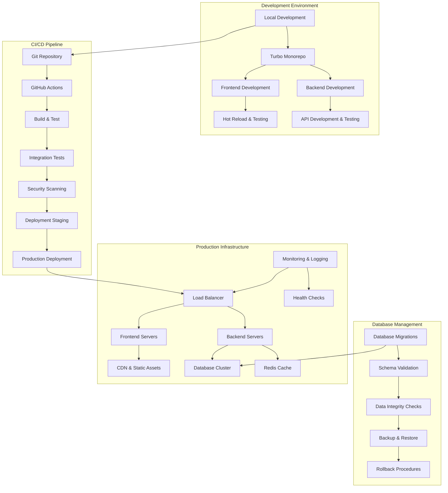
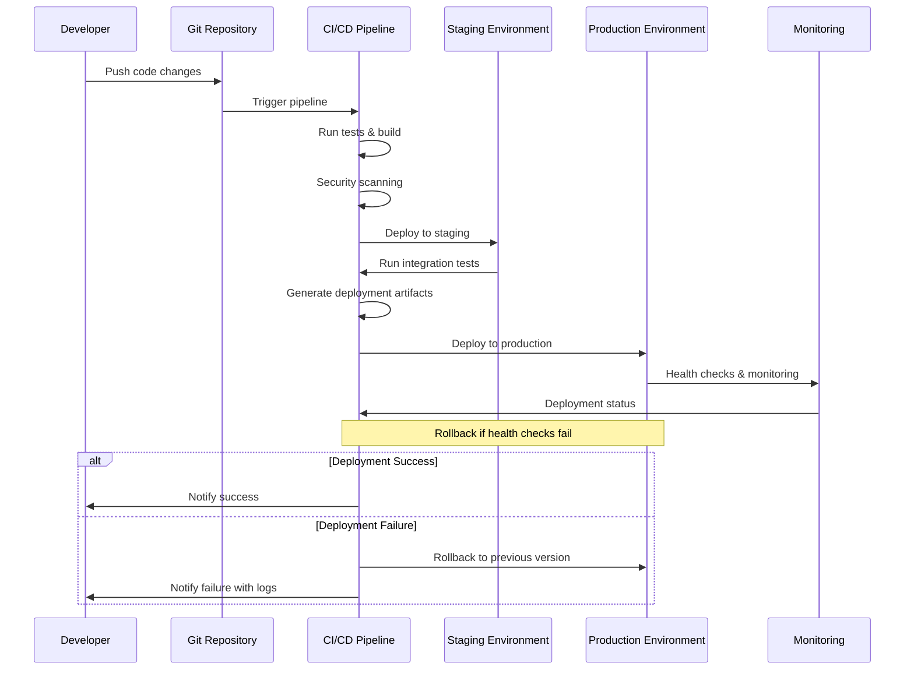

# Integration and Deployment Design

## Overview

การออกแบบระบบ integration และ deployment ที่ครอบคลุมสำหรับ monorepo ที่ประกอบด้วย Next.js frontend และ AdonisJS backend โดยมุ่งเน้นการสร้าง CI/CD pipeline ที่มีประสิทธิภาพ, database migration ที่ปลอดภัย, และ production deployment ที่เสถียร พร้อมระบบ monitoring และ rollback ที่ครอบคลุม

## Architecture

### Integration and Deployment Architecture



### Deployment Pipeline Flow



## Components and Interfaces

### 1. Monorepo Integration System

#### Turbo Configuration Interface
```typescript
interface TurboConfig {
  pipeline: {
    [task: string]: TaskConfig;
  };
  globalDependencies: string[];
  globalEnv: string[];
  remoteCache?: RemoteCacheConfig;
}

interface TaskConfig {
  dependsOn?: string[];
  outputs?: string[];
  cache?: boolean;
  persistent?: boolean;
  env?: string[];
  inputs?: string[];
}

interface MonorepoManager {
  buildAll(): Promise<BuildResult>;
  testAll(): Promise<TestResult>;
  lintAll(): Promise<LintResult>;
  deployAll(environment: Environment): Promise<DeploymentResult>;
  validateDependencies(): Promise<DependencyValidation>;
  syncPackageVersions(): Promise<void>;
}

interface BuildResult {
  success: boolean;
  packages: PackageBuildResult[];
  totalTime: number;
  cacheHitRate: number;
  errors: BuildError[];
}

interface PackageBuildResult {
  name: string;
  success: boolean;
  buildTime: number;
  outputSize: number;
  cached: boolean;
  errors: string[];
}
```

#### Package Integration Interface
```typescript
interface PackageIntegration {
  validatePackageStructure(): Promise<ValidationResult>;
  checkCrossDependencies(): Promise<DependencyCheck>;
  syncSharedTypes(): Promise<void>;
  generateAPIClient(): Promise<void>;
  updateSharedConfigurations(): Promise<void>;
}

interface DependencyCheck {
  valid: boolean;
  conflicts: DependencyConflict[];
  suggestions: string[];
  circularDependencies: string[];
}

interface DependencyConflict {
  package: string;
  conflictingVersions: string[];
  resolution: 'upgrade' | 'downgrade' | 'pin' | 'remove';
  impact: 'low' | 'medium' | 'high' | 'critical';
}
```

### 2. Database Migration and Validation System

#### Migration Manager Interface
```typescript
interface MigrationManager {
  runMigrations(environment: Environment): Promise<MigrationResult>;
  validateSchema(): Promise<SchemaValidation>;
  createBackup(): Promise<BackupResult>;
  rollbackMigration(version: string): Promise<RollbackResult>;
  checkDataIntegrity(): Promise<IntegrityCheck>;
  generateMigrationPlan(targetVersion: string): Promise<MigrationPlan>;
}

interface MigrationResult {
  success: boolean;
  appliedMigrations: Migration[];
  skippedMigrations: Migration[];
  errors: MigrationError[];
  executionTime: number;
  backupCreated: boolean;
}

interface Migration {
  id: string;
  name: string;
  version: string;
  description: string;
  sql: string;
  rollbackSql?: string;
  checksum: string;
  appliedAt?: DateTime;
  executionTime?: number;
}

interface SchemaValidation {
  valid: boolean;
  tables: TableValidation[];
  indexes: IndexValidation[];
  constraints: ConstraintValidation[];
  foreignKeys: ForeignKeyValidation[];
  issues: SchemaIssue[];
}

interface TableValidation {
  name: string;
  exists: boolean;
  columns: ColumnValidation[];
  rowCount: number;
  issues: string[];
}

interface IntegrityCheck {
  passed: boolean;
  checks: IntegrityCheckResult[];
  orphanedRecords: OrphanedRecord[];
  constraintViolations: ConstraintViolation[];
  recommendations: string[];
}
```

#### Backup and Restore System
```typescript
interface BackupManager {
  createFullBackup(): Promise<BackupResult>;
  createIncrementalBackup(): Promise<BackupResult>;
  restoreFromBackup(backupId: string): Promise<RestoreResult>;
  listBackups(): Promise<BackupInfo[]>;
  validateBackup(backupId: string): Promise<BackupValidation>;
  cleanupOldBackups(retentionDays: number): Promise<CleanupResult>;
}

interface BackupResult {
  id: string;
  type: 'full' | 'incremental';
  size: number;
  location: string;
  checksum: string;
  createdAt: DateTime;
  metadata: BackupMetadata;
}

interface BackupMetadata {
  databaseVersion: string;
  schemaVersion: string;
  recordCount: number;
  compressionRatio: number;
  encryptionEnabled: boolean;
}

interface RestoreResult {
  success: boolean;
  restoredTables: string[];
  restoredRecords: number;
  executionTime: number;
  warnings: string[];
  errors: string[];
}
```

### 3. CI/CD Pipeline System

#### Pipeline Manager Interface
```typescript
interface PipelineManager {
  triggerPipeline(trigger: PipelineTrigger): Promise<PipelineRun>;
  getPipelineStatus(runId: string): Promise<PipelineStatus>;
  cancelPipeline(runId: string): Promise<boolean>;
  retryPipeline(runId: string, fromStage?: string): Promise<PipelineRun>;
  getPipelineHistory(limit?: number): Promise<PipelineRun[]>;
  updatePipelineConfig(config: PipelineConfig): Promise<void>;
}

interface PipelineTrigger {
  type: 'push' | 'pull_request' | 'manual' | 'scheduled';
  branch: string;
  commit: string;
  author: string;
  message: string;
  environment: Environment;
}

interface PipelineRun {
  id: string;
  trigger: PipelineTrigger;
  status: PipelineStatus;
  stages: PipelineStage[];
  startedAt: DateTime;
  completedAt?: DateTime;
  duration?: number;
  artifacts: Artifact[];
}

interface PipelineStage {
  name: string;
  status: StageStatus;
  steps: PipelineStep[];
  startedAt?: DateTime;
  completedAt?: DateTime;
  duration?: number;
}

interface PipelineStep {
  name: string;
  command: string;
  status: StepStatus;
  output: string;
  exitCode?: number;
  startedAt?: DateTime;
  completedAt?: DateTime;
  duration?: number;
}

enum PipelineStatus {
  QUEUED = 'queued',
  RUNNING = 'running',
  SUCCESS = 'success',
  FAILED = 'failed',
  CANCELLED = 'cancelled',
  SKIPPED = 'skipped'
}
```

#### Deployment Manager Interface
```typescript
interface DeploymentManager {
  deployToEnvironment(environment: Environment, artifacts: Artifact[]): Promise<DeploymentResult>;
  rollbackDeployment(deploymentId: string): Promise<RollbackResult>;
  getDeploymentStatus(deploymentId: string): Promise<DeploymentStatus>;
  validateDeployment(deploymentId: string): Promise<ValidationResult>;
  promoteDeployment(fromEnv: Environment, toEnv: Environment): Promise<DeploymentResult>;
  scheduleDeployment(deployment: ScheduledDeployment): Promise<void>;
}

interface DeploymentResult {
  id: string;
  environment: Environment;
  version: string;
  status: DeploymentStatus;
  services: ServiceDeployment[];
  healthChecks: HealthCheckResult[];
  rollbackPlan: RollbackPlan;
  deployedAt: DateTime;
  duration: number;
}

interface ServiceDeployment {
  name: string;
  type: 'frontend' | 'backend' | 'database' | 'cache';
  version: string;
  status: DeploymentStatus;
  instances: ServiceInstance[];
  healthCheck: HealthCheckResult;
  metrics: ServiceMetrics;
}

interface ServiceInstance {
  id: string;
  host: string;
  port: number;
  status: 'healthy' | 'unhealthy' | 'starting' | 'stopping';
  uptime: number;
  lastHealthCheck: DateTime;
}

enum Environment {
  DEVELOPMENT = 'development',
  STAGING = 'staging',
  PRODUCTION = 'production'
}
```

### 4. Health Monitoring and Validation System

#### Health Check System Interface
```typescript
interface HealthCheckManager {
  runAllHealthChecks(): Promise<HealthCheckSummary>;
  runServiceHealthCheck(service: string): Promise<HealthCheckResult>;
  registerHealthCheck(check: HealthCheckDefinition): void;
  scheduleHealthChecks(): void;
  getHealthHistory(service?: string): Promise<HealthCheckHistory[]>;
  setHealthCheckAlerts(alerts: HealthCheckAlert[]): void;
}

interface HealthCheckResult {
  service: string;
  status: 'healthy' | 'unhealthy' | 'degraded';
  checks: IndividualCheck[];
  responseTime: number;
  timestamp: DateTime;
  metadata: Record<string, any>;
}

interface IndividualCheck {
  name: string;
  status: 'pass' | 'fail' | 'warn';
  message: string;
  value?: any;
  threshold?: any;
  duration: number;
}

interface HealthCheckSummary {
  overall: 'healthy' | 'unhealthy' | 'degraded';
  services: HealthCheckResult[];
  totalChecks: number;
  passedChecks: number;
  failedChecks: number;
  warnings: number;
  lastUpdated: DateTime;
}

interface HealthCheckDefinition {
  name: string;
  service: string;
  type: 'http' | 'database' | 'redis' | 'custom';
  endpoint?: string;
  query?: string;
  timeout: number;
  interval: number;
  retries: number;
  thresholds: HealthCheckThresholds;
}

interface HealthCheckThresholds {
  responseTime: number;
  errorRate: number;
  availability: number;
  custom?: Record<string, number>;
}
```

#### Performance Monitoring Interface
```typescript
interface PerformanceMonitor {
  collectMetrics(): Promise<SystemMetrics>;
  trackResponseTimes(service: string): Promise<ResponseTimeMetrics>;
  monitorResourceUsage(): Promise<ResourceMetrics>;
  generatePerformanceReport(): Promise<PerformanceReport>;
  setPerformanceAlerts(alerts: PerformanceAlert[]): void;
  getPerformanceTrends(timeRange: TimeRange): Promise<PerformanceTrend[]>;
}

interface SystemMetrics {
  timestamp: DateTime;
  cpu: CPUMetrics;
  memory: MemoryMetrics;
  disk: DiskMetrics;
  network: NetworkMetrics;
  database: DatabaseMetrics;
  cache: CacheMetrics;
}

interface ResponseTimeMetrics {
  service: string;
  endpoint: string;
  averageResponseTime: number;
  p50: number;
  p95: number;
  p99: number;
  requestCount: number;
  errorRate: number;
  timestamp: DateTime;
}

interface PerformanceReport {
  period: TimeRange;
  summary: PerformanceSummary;
  services: ServicePerformance[];
  recommendations: PerformanceRecommendation[];
  alerts: PerformanceAlert[];
}
```

## Data Models

### Configuration Models
```typescript
interface DeploymentConfig {
  environments: {
    [key in Environment]: EnvironmentConfig;
  };
  pipeline: PipelineConfig;
  monitoring: MonitoringConfig;
  security: SecurityConfig;
}

interface EnvironmentConfig {
  name: string;
  url: string;
  database: DatabaseConfig;
  redis: RedisConfig;
  secrets: SecretConfig;
  scaling: ScalingConfig;
  monitoring: EnvironmentMonitoringConfig;
}

interface PipelineConfig {
  stages: StageConfig[];
  triggers: TriggerConfig[];
  notifications: NotificationConfig[];
  artifacts: ArtifactConfig;
  security: PipelineSecurityConfig;
}

interface StageConfig {
  name: string;
  environment?: Environment;
  steps: StepConfig[];
  conditions: StageCondition[];
  timeout: number;
  retries: number;
}

interface StepConfig {
  name: string;
  type: 'build' | 'test' | 'deploy' | 'validate' | 'custom';
  command: string;
  workingDirectory?: string;
  environment?: Record<string, string>;
  timeout: number;
  continueOnError: boolean;
}
```

### Monitoring Models
```typescript
interface MonitoringConfig {
  healthChecks: HealthCheckConfig[];
  metrics: MetricsConfig;
  logging: LoggingConfig;
  alerts: AlertConfig[];
}

interface HealthCheckConfig {
  enabled: boolean;
  interval: number;
  timeout: number;
  retries: number;
  endpoints: HealthEndpoint[];
}

interface MetricsConfig {
  collection: {
    interval: number;
    retention: number;
    aggregation: AggregationConfig;
  };
  exporters: MetricsExporter[];
  dashboards: DashboardConfig[];
}

interface AlertConfig {
  name: string;
  condition: AlertCondition;
  severity: 'low' | 'medium' | 'high' | 'critical';
  channels: NotificationChannel[];
  cooldown: number;
  enabled: boolean;
}
```

## Error Handling and Recovery

### Deployment Error Handling
```typescript
enum DeploymentError {
  BUILD_FAILED = 'BUILD_FAILED',
  TEST_FAILED = 'TEST_FAILED',
  DEPLOYMENT_TIMEOUT = 'DEPLOYMENT_TIMEOUT',
  HEALTH_CHECK_FAILED = 'HEALTH_CHECK_FAILED',
  ROLLBACK_FAILED = 'ROLLBACK_FAILED',
  DATABASE_MIGRATION_FAILED = 'DATABASE_MIGRATION_FAILED',
  SERVICE_START_FAILED = 'SERVICE_START_FAILED',
  CONFIGURATION_ERROR = 'CONFIGURATION_ERROR',
  RESOURCE_UNAVAILABLE = 'RESOURCE_UNAVAILABLE',
  SECURITY_SCAN_FAILED = 'SECURITY_SCAN_FAILED',
}

interface DeploymentErrorHandler {
  handleError(error: DeploymentError, context: DeploymentContext): Promise<ErrorResolution>;
  logDeploymentEvent(event: DeploymentEvent): Promise<void>;
  notifyStakeholders(error: DeploymentError, context: DeploymentContext): Promise<void>;
  initiateRollback(deploymentId: string): Promise<RollbackResult>;
}

interface ErrorResolution {
  action: 'retry' | 'rollback' | 'manual_intervention' | 'skip';
  reason: string;
  steps: string[];
  estimatedTime: number;
  riskLevel: 'low' | 'medium' | 'high';
}

interface RollbackPlan {
  strategy: 'blue_green' | 'rolling' | 'immediate';
  steps: RollbackStep[];
  estimatedTime: number;
  dataBackup: boolean;
  validationChecks: string[];
}

interface RollbackStep {
  name: string;
  type: 'service' | 'database' | 'configuration' | 'validation';
  command: string;
  timeout: number;
  critical: boolean;
}
```

### Recovery Procedures
```typescript
interface RecoveryManager {
  createRecoveryPlan(incident: Incident): Promise<RecoveryPlan>;
  executeRecoveryPlan(planId: string): Promise<RecoveryResult>;
  validateRecovery(recoveryId: string): Promise<ValidationResult>;
  documentIncident(incident: Incident): Promise<void>;
  updateRunbooks(lessons: LessonsLearned): Promise<void>;
}

interface RecoveryPlan {
  id: string;
  incident: Incident;
  steps: RecoveryStep[];
  estimatedTime: number;
  riskAssessment: RiskAssessment;
  rollbackPlan: RollbackPlan;
  stakeholders: string[];
}

interface Incident {
  id: string;
  severity: 'low' | 'medium' | 'high' | 'critical';
  type: 'deployment' | 'performance' | 'security' | 'data';
  description: string;
  affectedServices: string[];
  startTime: DateTime;
  detectedBy: string;
  impact: ImpactAssessment;
}
```

## Security and Compliance

### Security Configuration
```typescript
interface SecurityConfig {
  authentication: AuthenticationConfig;
  authorization: AuthorizationConfig;
  encryption: EncryptionConfig;
  scanning: SecurityScanningConfig;
  compliance: ComplianceConfig;
}

interface SecurityScanningConfig {
  enabled: boolean;
  tools: SecurityTool[];
  schedule: ScanSchedule;
  thresholds: SecurityThresholds;
  reporting: SecurityReportingConfig;
}

interface SecurityTool {
  name: string;
  type: 'sast' | 'dast' | 'dependency' | 'container' | 'infrastructure';
  config: Record<string, any>;
  enabled: boolean;
}

interface SecurityThresholds {
  critical: number;
  high: number;
  medium: number;
  low: number;
  failOnCritical: boolean;
  failOnHigh: boolean;
}

interface ComplianceConfig {
  standards: ComplianceStandard[];
  auditing: AuditConfig;
  dataProtection: DataProtectionConfig;
  reporting: ComplianceReportingConfig;
}
```

## Performance and Optimization

### Performance Configuration
```typescript
interface PerformanceConfig {
  caching: CachingConfig;
  optimization: OptimizationConfig;
  monitoring: PerformanceMonitoringConfig;
  scaling: AutoScalingConfig;
}

interface CachingConfig {
  levels: CacheLevel[];
  strategies: CacheStrategy[];
  invalidation: CacheInvalidationConfig;
  monitoring: CacheMonitoringConfig;
}

interface OptimizationConfig {
  bundling: BundlingConfig;
  compression: CompressionConfig;
  minification: MinificationConfig;
  treeshaking: TreeshakingConfig;
}

interface AutoScalingConfig {
  enabled: boolean;
  metrics: ScalingMetric[];
  policies: ScalingPolicy[];
  limits: ScalingLimits;
}

interface ScalingPolicy {
  name: string;
  trigger: ScalingTrigger;
  action: ScalingAction;
  cooldown: number;
  enabled: boolean;
}
```

## Implementation Approach

### Phase 1: Monorepo Integration Setup
1. Configure Turbo for optimal build and test performance
2. Set up shared configurations and type definitions
3. Implement cross-package dependency management
4. Create development workflow automation

### Phase 2: CI/CD Pipeline Implementation
1. Set up GitHub Actions workflow with multi-stage pipeline
2. Implement automated testing and security scanning
3. Create artifact generation and storage system
4. Build deployment automation with rollback capabilities

### Phase 3: Database Migration System
1. Implement comprehensive migration management
2. Create backup and restore automation
3. Build data integrity validation system
4. Add migration rollback and recovery procedures

### Phase 4: Production Deployment Infrastructure
1. Set up production environment with load balancing
2. Implement health monitoring and alerting
3. Create performance monitoring and optimization
4. Build incident response and recovery procedures

### Phase 5: Advanced Features and Optimization
1. Implement blue-green deployment strategies
2. Add advanced monitoring and analytics
3. Create automated scaling and optimization
4. Build comprehensive documentation and runbooks

### Phase 6: Testing and Validation
1. Create comprehensive integration test suite
2. Implement load testing and performance validation
3. Add security testing and compliance validation
4. Build disaster recovery testing procedures

## API Endpoints Design

### Deployment Management Endpoints
```typescript
interface DeploymentEndpoints {
  'POST /api/deployments': {
    body: {
      environment: Environment;
      version: string;
      services?: string[];
      options?: DeploymentOptions;
    };
    response: DeploymentResult;
  };
  
  'GET /api/deployments/:id': {
    params: { id: string };
    response: DeploymentStatus;
  };
  
  'POST /api/deployments/:id/rollback': {
    params: { id: string };
    response: RollbackResult;
  };
  
  'GET /api/health': {
    response: HealthCheckSummary;
  };
  
  'GET /api/health/:service': {
    params: { service: string };
    response: HealthCheckResult;
  };
  
  'GET /api/metrics': {
    query?: { service?: string; timeRange?: string };
    response: SystemMetrics;
  };
}
```

### Pipeline Management Endpoints
```typescript
interface PipelineEndpoints {
  'POST /api/pipelines/trigger': {
    body: PipelineTrigger;
    response: PipelineRun;
  };
  
  'GET /api/pipelines/:id': {
    params: { id: string };
    response: PipelineRun;
  };
  
  'POST /api/pipelines/:id/cancel': {
    params: { id: string };
    response: { success: boolean };
  };
  
  'GET /api/pipelines': {
    query?: { limit?: number; status?: PipelineStatus };
    response: PipelineRun[];
  };
}
```

This comprehensive design covers all aspects of integration and deployment for the monorepo system, ensuring reliable, scalable, and maintainable deployment processes with proper monitoring, error handling, and recovery mechanisms.